# 研究变更记录

这份文档用于长期记录项目里的研究判断、实验变更、代码方向调整和论文表述收束。

更新方式：
- 你把新的原始文字、实验结论、疑问或修改想法发给我。
- 我负责阅读、去重、归类、压缩成可执行的记录。
- 新内容优先整理进“最新整理”，必要时再沉淀到“历史记录”。

建议每次更新都尽量落成下面这几类信息：
- 当前判断
- 已确认事实
- 主要风险或偏离点
- 下一步动作
- 对论文表述的影响

## 最新整理

> Branch artifact policy: `codex/proposed_v3` 使用 version-first traceable results layout：`results/<version-hash>/<case-name>/`。2026-04-20 当前同步范围包括 `87d7f16` V3 screening、`71650f7` ARD Method 2 full run、`local-8e021ea7` Full V2 C-route full run、`2962bc3` V2-lite run，以及仅含失败启动日志的 `local-aa29a0fd`。

### 2026-05-08：`local-345786ed` Batched pairwise-grid backend and middle-pair Case9 run

- Version hash: `local-345786ed`
- Base HEAD: `not-a-git-repo`
- Worktree state: uncommitted code changes; this local directory did not expose a `.git` repository.
- Change: accelerated `pairwise_grid_ml` without changing its covariance-fit objective. Candidate-pair scoring is now batched over all angle pairs, and Case9 precomputes reusable candidate pair indices once per run.
- Change: set default Case9 diagnostic pairs to middle, non-extreme, non-near-coincident angles: `[-12.2 -4.2; 6.8 16.8; 23.8 31.8]`, with `monteCarlo = 20`.
- Affected cases: Case9 pairwise-grid backend runtime and default diagnostic pair selection.
- Validation: `matlab -batch "addpath(genpath(pwd)); run_sanity_tests"`; `checkcode default_config.m run_project.m src/doa_backend_pairwise_grid_ml.m src/benchmark_music.m tests/run_sanity_tests.m`; traceable `run_project(9,cfg)`.
- Result path: `results/local-345786ed/`
- Case outputs: `case09_two_source_resolution/`

#### Case9 diagnostic observations

- Source pairs: `[-12.2 -4.2; 23.8 31.8; 6.8 16.8]`
- Monte Carlo: `20`
- Backend: `pairwise_grid_ml`
- Candidate pair count: `1991`
- Method order: `Ideal / Interpolation / ARD / Proposed V1 / Proposed V2 / Proposed V3.3 / HFSS Oracle`
- Overall mean resolution: `0.883300 / 1.000000 / 1.000000 / 1.000000 / 1.000000 / 1.000000 / 1.000000`
- Overall mean stable rate: `0.016700 / 0.533300 / 0.433300 / 0.533300 / 0.466700 / 0.450000 / 0.416700`
- Overall mean pair RMSE: `2.162100 / 0.478200 / 0.592700 / 0.468500 / 0.547000 / 0.544800 / 0.580200`
- Overall mean separation-collapse rate: `0.000000 / 0.000000 / 0.000000 / 0.000000 / 0.000000 / 0.000000 / 0.000000`

#### Interpretation

- The speedup is not a shortcut: the sanity test checks that batched pair scores match the original `covariance_score` objective on the reported top candidates.
- Runtime is now practical for a small middle-pair Case9 diagnostic. This is still not a full separation sweep benchmark.
- Current bottleneck is reduced but not eliminated; the remaining full active-set solve still loops over candidate pairs for the 3-variable active mask.

#### Key image

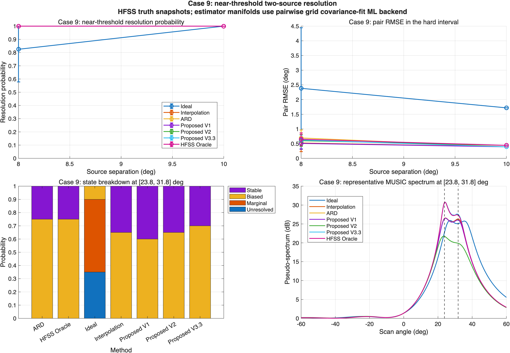

### 2026-05-08：`local-611f9a7b` Reduced Case9 pairwise-grid smoke

- Version hash: `local-611f9a7b`
- Base HEAD: `not-a-git-repo`
- Worktree state: uncommitted code changes; this local directory did not expose a `.git` repository.
- Change: reduced the default Case9 scale to `monteCarlo = 2` and `maxPairsPerSeparation = 2` so the pairwise-grid backend can be smoke-tested quickly.
- Affected cases: Case9 default run scale only. The backend remains `pairwise_grid_ml`.
- Validation: `checkcode default_config.m run_project.m src/benchmark_music.m`; traceable `run_project(9,cfg)` with the reduced default Case9 settings.
- Result path: `results/local-611f9a7b/`
- Case outputs: `case09_two_source_resolution/`

#### Case9 smoke observations

- Evaluated source pairs after task-pair exclusion: `11`
- Backend: `pairwise_grid_ml`
- Method order: `Ideal / Interpolation / ARD / Proposed V1 / Proposed V2 / Proposed V3.3 / HFSS Oracle`
- Overall mean resolution: `0.545500 / 0.909100 / 0.863600 / 0.954500 / 0.863600 / 0.909100 / 0.863600`
- Overall mean stable rate: `0.181800 / 0.045500 / 0.272700 / 0.045500 / 0.000000 / 0.272700 / 0.272700`
- Overall mean pair RMSE: `4.210000 / 2.349500 / 1.099200 / 2.288800 / 3.033300 / 0.779500 / 1.035300`
- Overall mean separation-collapse rate: `0.272700 / 0.000000 / 0.000000 / 0.000000 / 0.000000 / 0.000000 / 0.000000`

#### Interpretation

- The reduced Case9 path runs successfully and writes the expected traceable outputs.
- Because `monteCarlo = 2`, the plotted curves and rates are intentionally noisy and should be treated only as a smoke test.
- The run is useful for confirming the new backend wiring and runtime reduction, not for comparing final method quality.

#### Key image

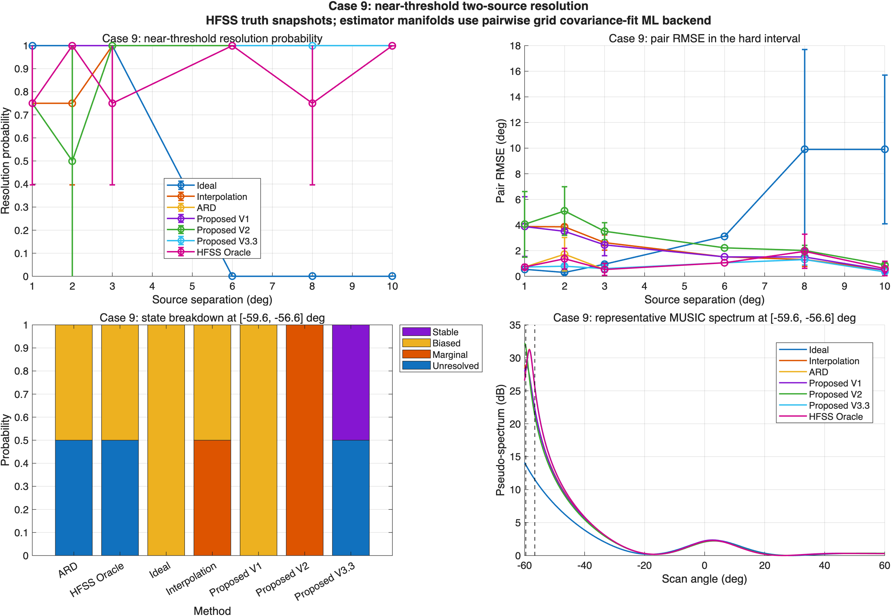

### 2026-05-08：`local-90eabbfe` Case9 default backend switched to pairwise grid ML

- Version hash: `local-90eabbfe`
- Base HEAD: `not-a-git-repo`
- Worktree state: uncommitted code changes; this local directory did not expose a `.git` repository.
- Change: set `cfg.case9.backendName = 'pairwise_grid_ml'` in `default_config.m`, so the default Case9 run now uses the strongest currently implemented backend instead of plain MUSIC peak picking.
- Affected cases: Case9 default run behavior. Other cases are unchanged.
- Validation: static `checkcode default_config.m run_project.m src/benchmark_music.m`; only existing style warnings were reported in `run_project.m`.
- Result path: none for this entry.
- Case outputs: not run by request; user will test Case9 manually.
- Remaining risk: the default backend uses a coarse configurable candidate grid (`backendCandidateAngleStrideDeg = 1` by default). This is appropriate for quick testing but may need refinement before final benchmark claims.

### 2026-05-08：`local-33952ce8` Case9 backend dispatch rewrite and pairwise-grid smoke

- Version hash: `local-33952ce8`
- Base HEAD: `not-a-git-repo`
- Worktree state: uncommitted code changes; this local directory did not expose a `.git` repository.
- Change: rewired `benchmark_music` so double-source Case9 can use a configurable backend while keeping default behavior as MUSIC. Supported non-default backends are `music_pair_rescore` and `pairwise_grid_ml`.
- Change: added Case9 backend config fields and recorded `backendName/backendCfg` into `case09_results.mat`. The representative spectrum panel remains the MUSIC pseudo-spectrum for interpretability, while the estimator backend is explicitly shown in the figure subtitle.
- Algorithm impact: default Case9 is unchanged unless `cfg.case9.backendName` is explicitly overridden.
- Validation: `checkcode default_config.m run_project.m src/benchmark_music.m tests/run_sanity_tests.m`; `matlab -batch "addpath(genpath(pwd)); run_sanity_tests"`; traceable Case9 smoke with `cfg.case9.backendName = 'pairwise_grid_ml'`, source pairs `[23.8 31.8; 35.8 45.8]`, `monteCarlo = 2`, and candidate stride `1 deg`.
- Result path: `results/local-33952ce8/`
- Case outputs: `case09_two_source_resolution/`

#### Case9 pairwise-backend smoke observations

- Backend: `pairwise_grid_ml`
- Candidate count: `57`
- Method order: `Ideal / Interpolation / ARD / Proposed V1 / Proposed V2 / Proposed V3.3 / HFSS Oracle`
- Mean resolution: `1.000000 / 1.000000 / 1.000000 / 1.000000 / 1.000000 / 1.000000 / 1.000000`
- Mean stable rate: `0.000000 / 0.250000 / 0.250000 / 0.250000 / 0.250000 / 0.250000 / 0.250000`
- Mean pair RMSE: `3.546600 / 0.603600 / 0.926800 / 1.176800 / 0.853600 / 0.926800 / 0.926800`
- Mean separation-collapse rate: `0.000000 / 0.000000 / 0.000000 / 0.000000 / 0.000000 / 0.000000 / 0.000000`

#### Interpretation

- This confirms that the Case9 backend can now be swapped without changing the manifold-method construction path.
- The pairwise-grid backend removes unresolved/collapse failures in this two-pair smoke, but the coarse `1 deg` candidate grid limits stable-rate and RMSE. This run is therefore a backend plumbing and diagnostic smoke, not a final performance claim.
- A defensible next backend step is local continuous refinement or a finer two-stage grid around the best covariance-fit pairs, rather than relying on a coarse exhaustive grid.

#### Key image

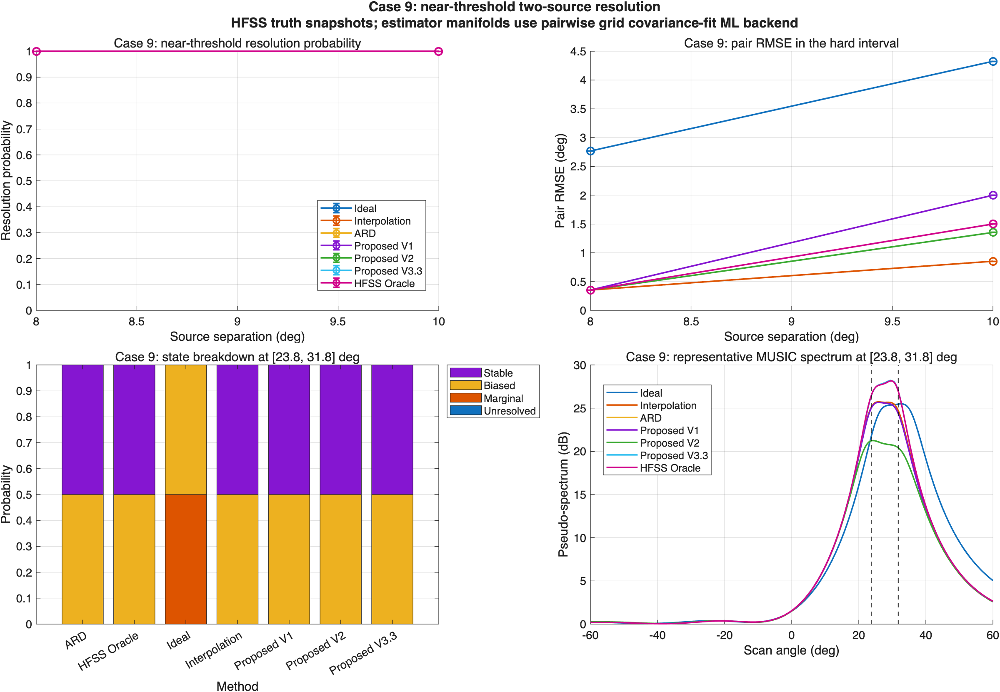

### 2026-05-08：`local-ab0828c3` Case11 backend diagnostic plot-label fix

- Version hash: `local-ab0828c3`
- Base HEAD: `not-a-git-repo`
- Worktree state: uncommitted code changes; this local directory did not expose a `.git` repository.
- Change: fixed Case11 backend diagnostic plotting labels. Backend names now render as plain display names instead of TeX-interpreted identifiers, and the long truth-snapshot subtitle was removed from compact summary plots to avoid title overlap.
- Algorithm impact: none. No DOA backend objective, manifold estimator, snapshot policy, or Case9 metric definition was changed.
- Affected cases: Case11 backend diagnostic output only; main Case9 benchmark path remains unchanged.
- Validation: `checkcode run_project.m`; `matlab -batch "addpath(genpath(pwd)); run_sanity_tests"`; traceable `run_project(11,cfg)` smoke with `[23.8 31.8; 35.8 45.8]` and `monteCarlo = 20`.
- Result path: `results/local-ab0828c3/`
- Case outputs: `case11_backend_diagnostic/`

#### Case11 smoke observations

- Backend order: `MUSIC / MUSIC pair rescore / Pairwise grid ML`.
- Method order: `ARD / Proposed V1 / Proposed V3.3 / HFSS Oracle`.
- Mean resolution:
  - MUSIC: `0.675000 / 0.500000 / 0.675000 / 0.675000`
  - MUSIC pair-rescore: `0.675000 / 0.500000 / 0.675000 / 0.675000`
  - Pairwise grid ML: `1.000000 / 1.000000 / 1.000000 / 1.000000`
- Mean stable rate:
  - MUSIC: `0.125000 / 0.025000 / 0.100000 / 0.100000`
  - MUSIC pair-rescore: `0.225000 / 0.025000 / 0.250000 / 0.200000`
  - Pairwise grid ML: `0.375000 / 0.300000 / 0.325000 / 0.375000`
- Mean pair RMSE:
  - MUSIC: `11.411900 / 17.339400 / 11.385500 / 11.403300`
  - MUSIC pair-rescore: `11.301400 / 17.272400 / 11.247200 / 11.284200`
  - Pairwise grid ML: `0.761300 / 0.888600 / 0.796700 / 0.736300`
- Oracle gain over MUSIC in mean resolution: `0.000000 / 0.000000 / 0.325000`.
- V3-to-Oracle resolution gap: `0.000000 / 0.000000 / 0.000000`.

#### Interpretation

- The previously reported `backend_oracle_ceiling.png` issue was a plotting/labeling problem, not a data-path bug.
- The orange `V3 gap to oracle` bar is absent because its value is exactly zero in this smoke; the blue `Pairwise grid ML` bar remains the meaningful oracle-ceiling signal.
- These numbers match the earlier Case11 smoke, so this rerun should not be interpreted as a new performance result.

#### Key image

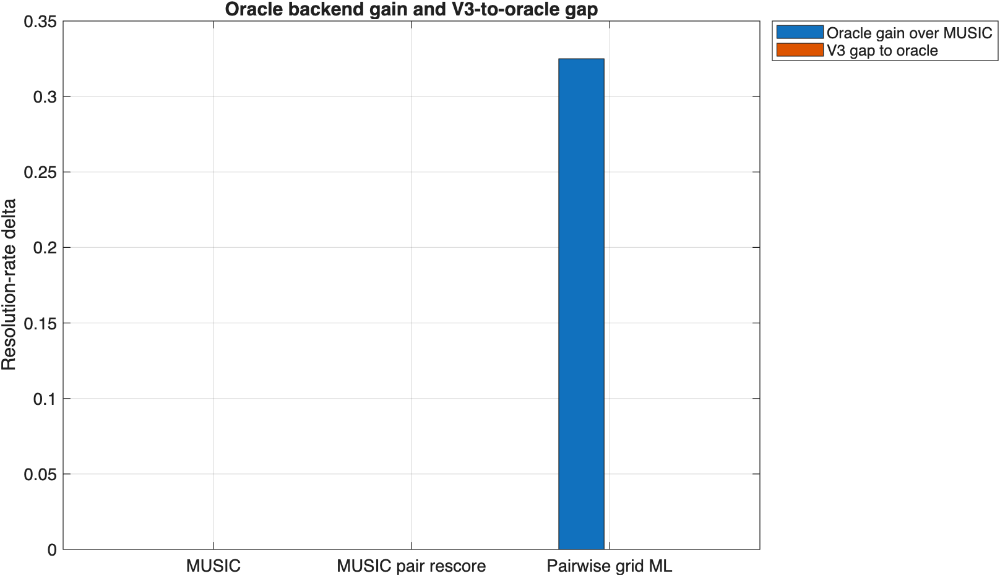

### 2026-05-08：`local-9b970264` Case11 enhanced backend diagnostic smoke

- Version hash: `local-9b970264`
- Base HEAD: `not-a-git-repo`
- Worktree state: uncommitted code changes; this local directory did not expose a `.git` repository, so `git status --short` returned `fatal: not a git repository`.
- Change: added a separate Case11 enhanced-backend diagnostic with common HFSS-truth snapshots across backends and methods. The diagnostic compares MUSIC, MUSIC pair-rescoring, and pairwise grid ML without replacing the main MUSIC Case9 benchmark.
- Affected cases: Case11 only; Case9 main benchmark remains unchanged.
- Validation: `checkcode default_config.m run_project.m src/*.m tests/*.m`; `matlab -batch "addpath(genpath(pwd)); run_sanity_tests"`; direct backend benchmark smoke; traceable Case11 smoke with `[23.8 31.8; 35.8 45.8]` and `monteCarlo = 20`.
- Result path: `results/local-9b970264/`
- Case outputs: `case11_backend_diagnostic/`
- Remaining risk: diagnostic smoke only; do not treat enhanced-backend numbers as main Proposed V3.3 performance claims.

#### Code and behavior changes

- Added backend utilities and callable backends: `doa_backend_music_baseline`, `doa_backend_music_pair_rescore`, and `doa_backend_pairwise_grid_ml`.
- Added `benchmark_doa_backends`, which keeps one common HFSS-truth snapshot matrix per `(target, MC)` trial and reuses it across all backends and methods.
- Added `cfg.case11` defaults and `run_project(11, cfg)` orchestration with traceable output, separate summary figures, and Case11-specific run notes.
- Added sanity tests for covariance fitting, backend classification guards, peak backfill, high-SNR backend recovery, common snapshots, singleton backend/method summary shapes, and malformed backend-output penalties.

#### Case11 smoke observations

- Backend order: `music / music_pair_rescore / pairwise_grid_ml`.
- Method order: `ARD / Proposed V1 / Proposed V3.3 / HFSS Oracle`.
- Mean resolution over the two smoke pairs:
  - MUSIC: `0.675000 / 0.500000 / 0.675000 / 0.675000`
  - MUSIC pair-rescore: `0.675000 / 0.500000 / 0.675000 / 0.675000`
  - Pairwise grid ML: `1.000000 / 1.000000 / 1.000000 / 1.000000`
- Mean stable rate:
  - MUSIC: `0.125000 / 0.025000 / 0.100000 / 0.100000`
  - MUSIC pair-rescore: `0.225000 / 0.025000 / 0.250000 / 0.200000`
  - Pairwise grid ML: `0.375000 / 0.300000 / 0.325000 / 0.375000`
- Mean pair RMSE:
  - MUSIC: `11.411900 / 17.339400 / 11.385500 / 11.403300`
  - MUSIC pair-rescore: `11.301400 / 17.272400 / 11.247200 / 11.284200`
  - Pairwise grid ML: `0.761300 / 0.888600 / 0.796700 / 0.736300`
- Oracle gain over MUSIC in mean resolution: `0.000000 / 0.000000 / 0.325000` for `music / music_pair_rescore / pairwise_grid_ml`.
- V3-to-Oracle resolution gap: `0.000000 / 0.000000 / 0.000000` in this two-pair smoke.

#### Interpretation

- Pairwise grid ML greatly improves the two-pair diagnostic result, including HFSS Oracle, which supports the hypothesis that plain MUSIC peak picking / independent peak selection is a material Case9 bottleneck.
- MUSIC pair-rescore improves stable rate but not mean resolution in this smoke, suggesting the current MUSIC spectrum still carries some useful information but the main ceiling lift comes from joint pair covariance fitting.
- Because this run uses only two source pairs and `monteCarlo = 20`, it is diagnostic evidence only. It should motivate a broader Case11 run before making paper-level claims.

#### Key image

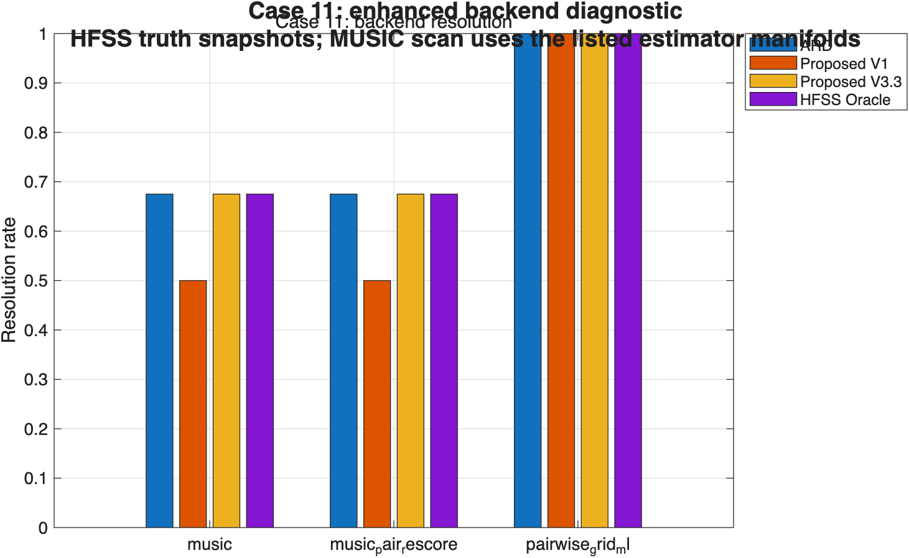

### 2026-05-08：`local-946087b9` reference-inspired cleanup and Case 9 smoke

- Version hash: `local-946087b9`
- Base HEAD: `not-a-git-repo`
- Worktree state: uncommitted code changes; this local directory did not expose a `.git` repository, so `git status --short` returned `fatal: not a git repository`.
- Change basis: read `reference/test` as an engineering reference and adopted the useful parts: explicit sanity tests, common-snapshot regression coverage, cleaner Case 9 helper separation, and narrower active algorithm surface.
- Result path: `results/local-946087b9/`
- Case outputs: `case09_two_source_resolution/`
- Run scope: Case 9 smoke only with `cfg.case9.sourcePairsDeg = [23.8 31.8; 35.8 45.8]` and `cfg.case9.monteCarlo = 2`; this is structural validation, not a new performance benchmark.

#### Code and behavior changes

- Added `tests/run_sanity_tests.m` using main project functions rather than copying `reference/test` simplified algorithms.
- Kept `benchmark_music.snapshotPolicy = common_truth_snapshots_across_methods` as the active policy and added a sanity regression that identical methods reuse identical snapshots per `(target, MC)` trial.
- Removed active GP-ANM fallback code from the current run path: no `cfg.case9.gpAnmFallback`, no `GP Diag Proxy`, no `gainPhaseDiagDiagnostics`, no `gpAnmFallback` output, and no active `src/benchmark_gp_anm_fallback.m`.
- Moved Case 9 pair generation/filtering, selection scoring, subset summaries, pair labels, stratum histograms, V1 diagnostics, and example selection into `src/case09_helpers.m`; `run_project.m` now keeps orchestration, plotting, and saving.
- Added diagnostic-only `estimatedSeparationCollapseRate`, defined as `estimated separation < 0.5 * true separation`. It does not replace the existing stable/biased/marginal/unresolved definitions.
- Updated README and V3.3 algorithm notes to say GP-ANM was evaluated as an offline diagnostic / future expensive baseline, not an active V3.3 fallback.

#### Validation

- Static check: `matlab -batch "checkcode default_config.m run_project.m src/*.m tests/*.m"` completed without run-blocking errors. Remaining messages are existing `datestr/now`, `STRCMPI`, and stale suppression warnings.
- The requested command `matlab -batch "addpath(genpath(pwd)); tests/run_sanity_tests"` is not valid MATLAB command syntax in this environment; MATLAB parsed `tests/run_sanity_tests` as an expression and returned `函数或变量 'tests' 无法识别`.
- Equivalent sanity command `matlab -batch "addpath(genpath(pwd)); run_sanity_tests"` passed all tests: HFSS loader/grid/normalization, calibration split, ideal manifold, ARD calibration reconstruction, HFSS oracle lookup, snapshot SNR eigengap, MUSIC single/double oracle, and common-snapshot policy.
- Case 9 smoke command used traceable output with `sourcePairsDeg = [23.8 31.8; 35.8 45.8]` and `monteCarlo = 2`.
- Smoke verification confirmed `case09_results.mat` contains `benchmark.snapshotPolicy = common_truth_snapshots_across_methods`, existing summaries, and `estimatedSeparationCollapseRate`; it does not contain `gpAnmFallback` or `gainPhaseDiagDiagnostics`.

#### Smoke observations

- Smoke method order: `Ideal / Interpolation / ARD / Proposed V1 / Proposed V2 / Proposed V3.3 / HFSS Oracle`.
- Mean resolution over the two smoke pairs: `0.000000 / 0.000000 / 0.500000 / 0.000000 / 0.250000 / 0.500000 / 0.500000`.
- Mean stable rate over the two smoke pairs: all methods `0.000000`.
- Mean pair RMSE over the two smoke pairs: `34.792081 / 33.566065 / 17.481492 / 33.598855 / 25.352719 / 17.545826 / 17.446554`.
- Mean estimated-separation collapse rate: all methods `0.000000`.

#### Key image

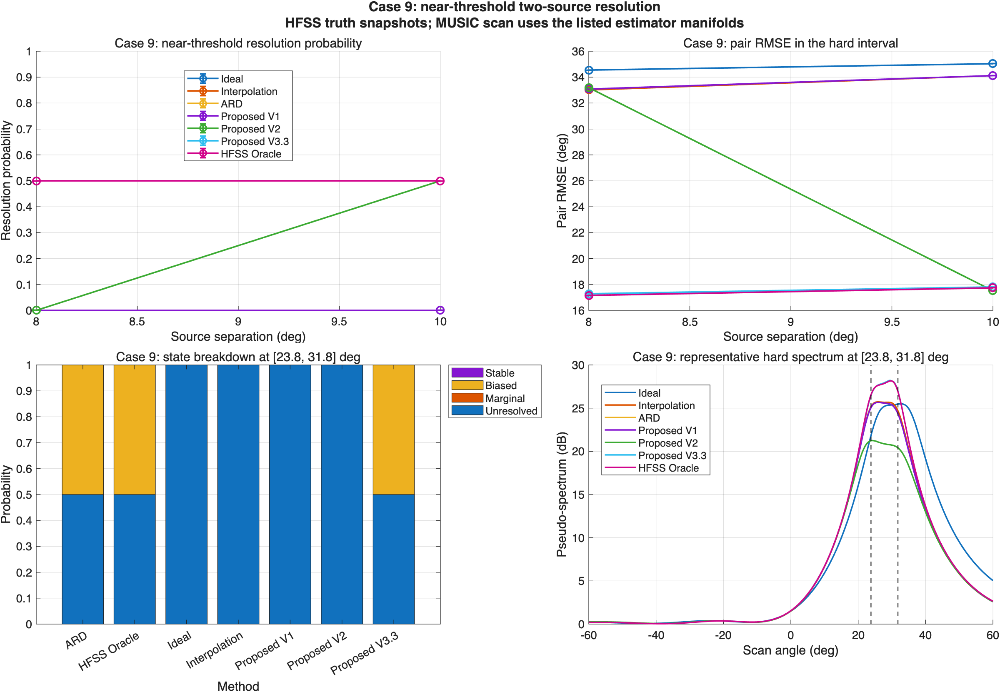

#### Remaining risk

- This smoke has only two pairs and two Monte Carlo trials; it validates structure and diagnostics, not final Case 9 performance.
- The exact slash-form sanity command in the plan is syntactically invalid in MATLAB; the executed command runs the same test file through the project path.
- Historical GP-ANM logs/results/PDF are intentionally retained as research history; only active code/config paths were removed.

### 2026-05-07：`local-9cd046fd` V3 algorithm documentation standalone rewrite

- Version hash: `local-9cd046fd`
- Base HEAD: `not-a-git-repo`
- Worktree state: uncommitted documentation reorganization; this local directory did not expose a `.git` repository, so `git status --short` returned `fatal: not a git repository`.
- Change: moved the previous V3 algorithm documents into `algorithms/archive/v3-before-independent-rewrite-20260507/` and rebuilt the root V3 documents as standalone complete algorithm flow descriptions.
- Affected cases: no experiment behavior changed.
- Validation: verified the archive contains the four prior V3 documents and the root `algorithms/proposed_algorithm_v3.0.md`, `proposed_algorithm_v3.1.md`, `proposed_algorithm_v3_2.md`, and `proposed_algorithm_v3_3.md` exist with independent sections for purpose, inputs/outputs, model, objective, optimization, algorithm flow, evaluation interpretation, limitations, and implementation pointers.
- Result path: `results/local-9cd046fd/`
- Case outputs: none.
- Remaining risk: documentation-only batch; no Case 9 rerun was performed and no new empirical claim is introduced.

#### Documentation scope

- `proposed_algorithm_v3.0.md`: describes the first ARD-anchored task-aware residual method and its known safety failure modes.
- `proposed_algorithm_v3.1.md`: describes the calibration-guarded safe residual method with trust radius, held-out guard, and ARD fallback.
- `proposed_algorithm_v3_2.md`: describes the distribution-matched stable-neighborhood pair objective as a full standalone method.
- `proposed_algorithm_v3_3.md`: describes the current Case-9-aligned global stable-pair method with 5 dB task projector, peak score, and global competitor background.

### 2026-05-07：`fadea59` Proposed V3.3 algorithm documentation

- Version hash: `fadea59`
- Base HEAD: `not-a-git-repo`
- Worktree state: uncommitted documentation changes; this local directory did not expose a `.git` repository, so `git status --short` returned `fatal: not a git repository`.
- Change: added `algorithms/proposed_algorithm_v3_3.md` to document the current Proposed V3.3 implementation.
- Affected cases: no experiment behavior changed; the document describes the current Case 9-aligned V3.3 algorithm.
- Validation: inspected the document and confirmed it records the implemented V3.3 stage, backbone, task SNR, weights, peak score, global competitor background, objective terms, evaluation interpretation, and known limitations.
- Result path: `results/fadea59/`
- Case outputs: none.
- Remaining risk: documentation-only batch; no Case 9 rerun was performed and no new empirical claim is introduced.

#### Documentation scope

- The document names the method as **AATRC-V3.3: ARD-Anchored Case-9-Aligned Global Stable-Pair Residual Calibration**.
- It records that V3.3 keeps the ARD-anchored safe phase residual backbone from V3.2.
- It documents the V3.3-specific changes: `taskSnrDb = 5`, `lambdaSingle = 0.02`, `lambdaPair = 0.08`, `stableScoreMode = peak`, and `stableBackgroundMode = global_competitor`.
- It explicitly states that V3.3 remains competitive in resolution/RMSE but still does not close the stable-rate gap to Proposed V1.

### 2026-05-06：`602158e` Case 9 common-snapshot rerun for meaningful spectrum comparison

- Version hash: `602158e`
- Former pending local hash: `local-b2472f86`
- Base HEAD: `not-a-git-repo`
- Worktree state: uncommitted code changes; this local directory did not expose a `.git` repository, so `git status --short` returned `fatal: not a git repository`.
- Change basis: the prior Case 9 representative spectrum could be misleading because `benchmark_music` generated independent random snapshots inside each method loop. That allowed one method to look better partly because it received a more favorable noise realization.
- Run command: `run_project(9, cfg)` with traceable output enabled, default Case 9 pair sweep, default SNR/snapshots, `monteCarlo = 80`, V3.3, and GP-ANM fallback disabled.
- Result path: `results/602158e/`
- Case outputs: `case09_two_source_resolution/`
- Run scope: Case 9 only; this is a screening rerun with corrected snapshot policy, not a full paper-profile result.

#### Code and behavior changes

- `src/benchmark_music.m` now pre-generates one HFSS-truth snapshot matrix per `(target, Monte Carlo)` trial and reuses that same matrix for every evaluated method.
- `benchmark_music` records `snapshotPolicy = common_truth_snapshots_across_methods` in its result struct.
- `run_project.m` writes the MUSIC snapshot policy into version-level `RUN_NOTES.md`.
- No V3.3 training objective, label, or manifold construction was changed.

#### Validation and Case 9 result

- Smoke validation asserted `snapshotPolicy = common_truth_snapshots_across_methods` on a two-method benchmark.
- `checkcode`: `src/benchmark_music.m` had no output; `run_project.m` retained existing `datestr/now`, `STRCMPI`, and suppressed-message style warnings only.
- Case 9 leakage check remained clean: `taskEvalOverlapCount = 0`, `taskExcludedPairCount = 16`, evaluation pairs `152`.
- All-separation resolution: `ARD 0.123520 / Proposed V1 0.126891 / V3.3 0.126562 / HFSS Oracle 0.122533`.
- All-separation stable: `ARD 0.032730 / Proposed V1 0.037253 / V3.3 0.033388 / HFSS Oracle 0.032730`.
- Discriminative `>=6 deg` resolution: `ARD 0.305328 / Proposed V1 0.314344 / V3.3 0.312500 / HFSS Oracle 0.303074`.
- Discriminative `>=6 deg` stable: `ARD 0.081148 / Proposed V1 0.092828 / V3.3 0.082582 / HFSS Oracle 0.081148`.
- Discriminative `>=6 deg` mean pair RMSE: `ARD 28.107252 / Proposed V1 27.747758 / V3.3 27.664849 / HFSS Oracle 28.195703`.
- Representative pair selected by the existing Case 9 selector was `[35.8, 45.8] deg`. Under common snapshots, ARD, V1, V3.3, and HFSS Oracle all produced marginal two-source estimates clustered around `[36.8, 43] deg`; the plot no longer supports interpreting a single V3.3 spectrum as uniquely strong.

#### Key image

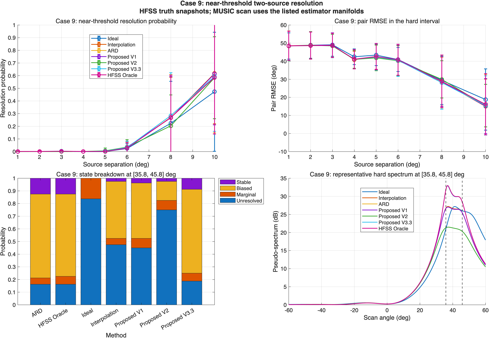

#### Judgment and risk

- The common-snapshot rerun makes the visual comparison more meaningful and removes the previous method-specific noise draw artifact.
- The result still supports the earlier diagnosis: V3.3 is competitive on resolution and RMSE, especially for `>=6 deg`, but its stable-rate gap to Proposed V1 remains material.
- Proposed V1 remains the clearest stable-rate reference in this Case 9 setup. V3.3's representative spectrum can look good, but the corrected run shows that the statistically reliable advantage has not arrived yet.

### 2026-05-06：`local-2f83ff50` GP-ANM fallback backend smoke

- Version hash: `local-2f83ff50`
- Base HEAD: `not-a-git-repo`
- Worktree state: uncommitted code changes; this local directory did not expose a `.git` repository, so `git status --short` returned `fatal: not a git repository`.
- Change basis: local review of `algorithms/A_New_Atomic_Norm_for_DOA_Estimation_With_Gain-Phase_Errors.pdf` suggested GP-ANM could be tested as an expensive backend fallback, but its fixed diagonal gain-phase error model may not match the angle-dependent HFSS manifold residual.
- Run command: `run_project(9, cfg)` with traceable output enabled, manual Case 9 pair `[23.8, 31.8] deg`, default SNR/snapshots, `monteCarlo = 2`, `GP Diag Proxy` enabled, and GP-ANM SDP probe enabled.
- Result path: `results/local-2f83ff50/`
- Case outputs: `case09_two_source_resolution/`
- Run scope: Case 9 smoke only; this is not a full paper-profile result.

#### Code and behavior changes

- `default_config.m` now has `cfg.case9.gpAnmFallback`, disabled by default, with explicit controls for `enabled`, `addDiagonalProxy`, `maxPairs`, `monteCarlo`, `errorRadius`, and `tauEta`.
- `run_project.m` keeps the normal V3.3/MUSIC flow unchanged by default. When `cfg.case9.gpAnmFallback.addDiagonalProxy = true`, Case 9 appends `GP Diag Proxy`, a fixed common diagonal gain-phase correction fitted only from calibration angles.
- `run_project.m` also records `gainPhaseDiagDiagnostics` and `gpAnmFallback` inside `case09_results.mat`.
- `src/benchmark_gp_anm_fallback.m` was added as an isolated GP-ANM backend probe. It checks for CVX before solving the SDP; without CVX it returns `status = skipped` rather than failing the Case 9 run.
- Version-level `RUN_NOTES.md` now records the Case 9 GP-ANM fallback settings.

#### Smoke result

- MATLAB environment check found no `cvx_begin`, `mosekopt`, `sedumi`, `sdpt3`, or `sdpvar`; therefore the true GP-ANM SDP backend was skipped with reason `CVX is not available on the MATLAB path; GP-ANM SDP was not run.`
- The fast fixed-diagonal proxy barely changed the held-out manifold error: Ideal mean relative error `0.320988`, GP Diag Proxy mean relative error `0.320915`, delta `-0.000073`.
- On the two-trial `[23.8, 31.8] deg` smoke pair, `GP Diag Proxy` did not resolve the pair: RMSE `33.969721`, stable `0.000000`, resolution `0.000000`.
- Same smoke pair reference values were: ARD RMSE `16.149826`, resolution `0.500000`; HFSS Oracle RMSE `16.879381`, resolution `0.500000`; Proposed V3.3 RMSE `32.167814`, resolution `0.000000`.
- `checkcode` did not show run-blocking errors. `run_project.m` retained existing `datestr/now`, `STRCMPI`, and suppressed-message warnings; `src/benchmark_gp_anm_fallback.m` showed expected Code Analyzer warnings on CVX constraint lines when CVX is not installed.

#### Key image

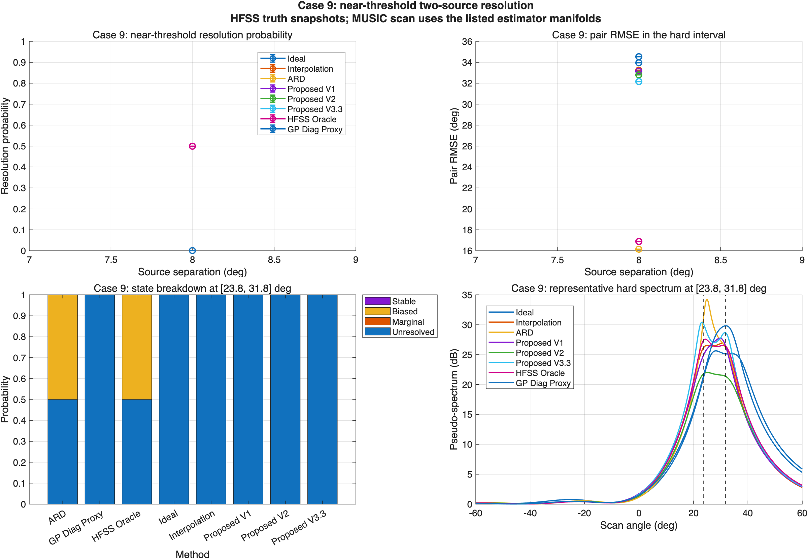

#### Judgment and risk

- This smoke does not evaluate the full GP-ANM SDP because the local MATLAB environment lacks CVX or an equivalent SDP stack.
- The fixed diagonal proxy result is still informative: a single common gain-phase vector fitted from calibration angles explains almost none of the HFSS-vs-ideal manifold gap. That weakens the case for treating the paper's model as a direct backend fallback for this project.
- If GP-ANM is pursued further, it should remain an isolated expensive baseline after installing CVX/SDPT3/SeDuMi/MOSEK, not a default Proposed V3.3 backend component.

### 2026-05-05：`local-f4d31977` rollback to Proposed V3.3

- Version hash: `local-f4d31977`
- Base HEAD: `not-a-git-repo`
- Worktree state: rollback code changes; this local directory did not expose a `.git` repository, so `git status --short` returned `fatal: not a git repository`.
- Change: reverted the V3.4 V1-shape teacher code path and restored Proposed V3.3 defaults and labels.
- Affected files: `default_config.m`, `src/build_sparse_models.m`, `run_project.m`, `docs/research-log.md`, `results/local-f4d31977/RUN_NOTES.md`, `results/local-f4d31977/manifest.md`.
- Validation: MATLAB model smoke only; no full Case 9 rerun.
- Result path: `results/local-f4d31977/`
- Case outputs: none.
- Remaining risk: this rollback restores the V3.3 code path and keeps the prior V3.3 Case 9 evidence in `results/local-908d3013/`; it does not regenerate Case 9 under a new hash.

#### Rollback details

- `default_config.m` now sets `cfg.model.v3.label = Proposed V3.3` and `cfg.model.v3.stage = case9_aligned_global_stable_refinement`.
- V3.4-only fields `lambdaV1Shape`, `v1ShapeEnabled`, `v1ShapeValleySlack`, and `v1ShapeBalanceSlack` were removed from the active config/default completion path.
- `src/build_sparse_models.m` no longer passes `AProposedV1` into V3 refinement, no longer creates `v1ShapeTargets`, and no longer includes `components.v1Shape` in the V3 objective.
- `run_project.m` method labels and run notes now report `Proposed V3.3` again.
- Case 9 `>=6 deg` discriminative summaries, true-DOA spectrum markers, and `v1ExperienceDiagnostics` were retained because they are evaluation/diagnostic improvements from `local-908d3013`, not part of the V3.4 teacher rollback.
- Historical `results/local-9023b401/` and its log entry are retained as the failed V3.4 screening record.

#### Validation

- MATLAB smoke command built the project context, selected representative calibration indices, and ran `build_sparse_models`.
- Assertions passed:
  - `models.v3Diagnostics.label == Proposed V3.3`
  - `models.v3Diagnostics.finalComponents` has no `v1Shape`
  - `models.v3Diagnostics` has no `v1ShapeDiagnostics`
- Smoke output: `label=Proposed V3.3 stage=case9_aligned_global_stable_refinement obj 0.730981 -> 0.458960 fallback=0`。

### 2026-05-05：`local-9023b401` Proposed V3.4 V1 shape-guided screening

- Version hash: `local-9023b401`
- Base HEAD: `not-a-git-repo`
- Worktree state: uncommitted code changes; this local directory did not expose a `.git` repository, so `git status --short` returned `fatal: not a git repository`.
- Change basis: visual inspection of Case 9 representative spectrum showed Proposed V1 has lower absolute peaks but a more standard two-peak shape: better endpoint balance, clearer valley, and peaks aligned with true DOA markers.
- Run command: `run_project(9, cfg)` with `default_config(pwd)`, traceable output enabled, default Case 9 Monte Carlo `80`.
- Result path: `results/local-9023b401/`
- Case outputs: `case09_two_source_resolution/`
- Run scope: Case 9 only screening; this is not a full paper-profile result.

#### 代码与行为变化

- `default_config.m` 和 `run_project.m` 将 V3 label 更新为 `Proposed V3.4`，stage 更新为 `v1_shape_guided_global_stable_refinement`。
- `src/build_sparse_models.m` 的 V3 构建现在接收 `AProposedV1` 作为 training-only shape teacher。
- V3 objective 新增 `components.v1Shape` 和 `lambdaV1Shape = 0.06`。该项只在 V3 held-out task pairs 上比较谱形，不使用 Case 9 evaluation pairs。
- V1 shape teacher 只约束两个谱形量：`valleyMargin = min(endpoint scores) - midpoint score` 和 `balance = |left endpoint score - right endpoint score|`。它不模仿绝对峰高，避免把 V1 的低峰值也学进去。
- V3 diagnostics 新增 `v1ShapeDiagnostics`，记录 V1 与 candidate 的 valley margin / balance gap。

#### 验证与 Case 9 结果

- MATLAB model smoke：`AProposedV3` 尺寸匹配 `ctx.AH`，`finalComponents.v1Shape` 和 `v1ShapeDiagnostics` 存在；V3.4 未触发 fallback。
- V3.4 objective: initial `1.144583`，final `0.722737`，`usedARDFallback = 0`。
- V1-shape diagnostics: final `v1Shape = 4.345433`，mean valley margin gap `+28.4511`，mean balance gap `+3.7659`。这说明 V3.4 的 valley 已不弱于 V1，但左右峰 balance 仍明显差于 V1。
- Guard metrics: calibration drift `1.68e-16`，guard relative excess `0.00258`，anchor RMS drift `0.00354`，均低于当前 guard 阈值。
- Case 9 all-separation stable rate: `ARD 0.035691 / Proposed V1 0.038898 / V3.4 0.036266 / HFSS Oracle 0.035033`。
- Case 9 discriminative `>=6 deg` stable rate: `ARD 0.088730 / Proposed V1 0.096311 / V3.4 0.089959 / HFSS Oracle 0.087295`。
- Case 9 discriminative `>=6 deg` resolution: `ARD 0.307172 / Proposed V1 0.313730 / V3.4 0.309426 / HFSS Oracle 0.303689`。
- V3.4 versus V3.3: stable rate did not improve in this default Case 9 run; discriminative resolution increased slightly from `0.308402` to `0.309426` and discriminative RMSE improved from `28.006790` to `27.960250`。
- Proposed V1 remains ahead of V3.4 on stable rate: all-separation gap `-0.002632`，discriminative `>=6 deg` gap `-0.006352`。
- A small weight probe with `lambdaV1Shape = 0.06 / 0.15 / 0.30 / 0.60` showed the balance gap did not materially shrink under the current SPSA/residual/anchor setup; simply increasing teacher weight is not sufficient.
- `checkcode`: `default_config.m` no output；`src/build_sparse_models.m` only retained existing suppressed-message notices；`run_project.m` retained existing `datestr/now`、`STRCMPI` and suppressed-message style warnings. No run-blocking warning was observed.

#### 关键图片

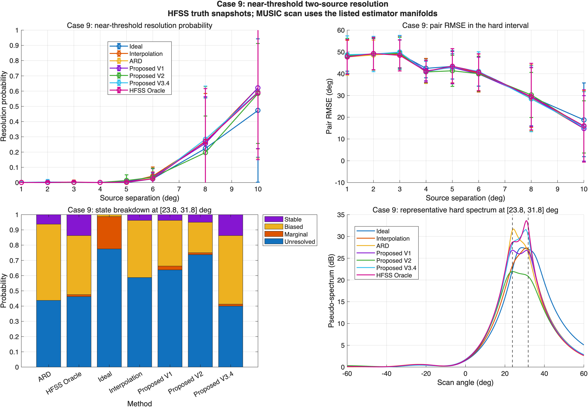

#### 判断与风险

- This run implemented the requested V1 experience transfer in a controlled way, but the result is not yet a successful V3 improvement on stable rate.
- The useful signal is diagnostic: V1's main advantage is endpoint balance, not endpoint height or valley depth. V3.4 already has strong valley margin but still has excessive endpoint imbalance.
- The next improvement should target the residual parameterization or optimization path that can specifically change endpoint balance, rather than only increasing `lambdaV1Shape`.

### 2026-05-05：`local-908d3013` Case 9 discriminative split and true-DOA spectrum markers

- Version hash: `local-908d3013`
- Base HEAD: `not-a-git-repo`
- Worktree state: uncommitted code changes; this local directory did not expose a `.git` repository, so `git status --short` returned `fatal: not a git repository`.
- Change basis: previous Case 9 diagnosis that the all-separation mean is dominated by near-impossible `1-5 deg` pairs, and that Proposed V1 remains a useful two-source reference.
- Run command: `run_project(9, cfg)` with `default_config(pwd)`, traceable output enabled, default Case 9 Monte Carlo `80`.
- Result path: `results/local-908d3013/`
- Case outputs: `case09_two_source_resolution/`
- Run scope: Case 9 only screening; this is not a full paper-profile result.

#### 代码与行为变化

- `default_config.m` 新增 `cfg.case9.discriminativeMinSeparationDeg = 6`，将 Case 9 的可区分区间固定为 separation `>= 6 deg`。
- `run_project.m` 的 Case 9 结果新增 `overallSummary`、`discriminativeSummary`、`discriminativeMask` 和 `discriminativeMinSeparationDeg`，同时保存 all-separation 与 `>=6 deg` 两套 method-level 指标。
- Case 9 代表谱图新增两条 true DOA 黑色虚线，便于直接检查各方法谱峰相对真实角的位置。
- Case 9 新增 `v1ExperienceDiagnostics`，记录 Proposed V1 相对 ARD、V3.3 相对 V1 的 resolution/stable 差值，用于后续从 V1 的双源表现中提炼训练目标，而不把测试集结果用于方法选择。

#### 验证与 Case 9 结果

- MATLAB smoke：用 `cfg.case9.monteCarlo = 2` 跑通 Case 9，确认 `discriminativeSummary`、`overallSummary` 和 `v1ExperienceDiagnostics` 存在。
- `checkcode`: `default_config.m` no output；`src/build_sparse_models.m` 仅保留既有 suppressed-message notices；`run_project.m` 保留既有 `datestr/now`、`STRCMPI` 和 suppressed-message 风格提示，无 run-blocking warning。
- Case 9 leakage check 仍由原逻辑执行，正式结果保存在 `results/local-908d3013/case09_two_source_resolution/case09_results.mat`。
- All-separation stable rate: `ARD 0.035691 / Proposed V1 0.038898 / V3.3 0.036266 / HFSS Oracle 0.035033`。
- Discriminative `>=6 deg` stable rate: `ARD 0.088730 / Proposed V1 0.096311 / V3.3 0.089959 / HFSS Oracle 0.087295`。
- Discriminative `>=6 deg` resolution: `ARD 0.307172 / Proposed V1 0.313730 / V3.3 0.308402 / HFSS Oracle 0.303689`。
- Proposed V1 stable advantage over ARD: all-separation `+0.003207`，discriminative `>=6 deg` `+0.007582`。
- V3.3 stable gap to Proposed V1: all-separation `-0.002632`，discriminative `>=6 deg` `-0.006352`。
- Proposed V1 stable delta over ARD by separation `1/2/3/4/5/6/8/10 deg`: `+0.0000 / +0.0000 / +0.0000 / +0.0000 / +0.0016 / +0.0007 / +0.0131 / +0.0083`。
- V3.3 stable delta against Proposed V1 by separation `1/2/3/4/5/6/8/10 deg`: `+0.0006 / +0.0000 / +0.0000 / +0.0000 / -0.0016 / -0.0033 / +0.0000 / -0.0155`。

#### 关键图片


#### 判断与风险

- Case 9 拆分后更清楚：`1-5 deg` 主要是 feasibility stress，不适合单独支撑 proposed 方法优劣；`>=6 deg` 更适合作为 discriminative resolution 指标。
- Proposed V1 在 `>=6 deg` stable 上比 ARD 高 `+0.007582`，说明它的低阶全局 phase residual 对双源 peak selection 有可借鉴价值。
- 当前 V3.3 虽然在 all-separation stable 上略高于 ARD，但在 discriminative stable 上仍低于 Proposed V1 `-0.006352`。下一步应从 V1 的全局平滑/谱峰选择特性提炼训练约束，而不是用测试结果做 V1/V3 后验选择。

### 2026-05-05：`local-e3cbbcee` Proposed V3.3 Case 9-aligned global stable-pair screening

- Version hash: `local-e3cbbcee`
- Base HEAD: `not-a-git-repo`
- Worktree state: uncommitted code changes; this local directory did not expose a `.git` repository, so `git status --short` and `git rev-parse --short HEAD` both returned `fatal: not a git repository`.
- Change basis: local diagnosis that V3.2's pair surrogate optimized local exact-covariance double peaks at 25 dB, while Case 9 evaluates 5 dB random-snapshot MUSIC with global top-k peak competition and a strict stable criterion.
- Run command: `run_project(9, cfg)` with `default_config(pwd)`, traceable output enabled, default Case 9 Monte Carlo `80`.
- Result path: `results/local-e3cbbcee/`
- Case outputs: `case09_two_source_resolution/`
- Run scope: Case 9 only screening; this is not a full paper-profile result.

#### 代码与行为变化

- `default_config.m` 将 V3 label 更新为 `Proposed V3.3`，stage 更新为 `case9_aligned_global_stable_refinement`。
- V3 task SNR 从 `25 dB` 调整为 `5 dB`，与 Case 9 evaluation SNR 对齐。
- V3 task weights 调整为 `lambdaSingle = 0.02`、`lambdaPair = 0.08`，把本轮筛选重心放在双源 pair loss。
- `src/build_sparse_models.m` 新增 `stableScoreMode = peak` 和 `stableBackgroundMode = global_competitor`：endpoint、midpoint、background 评分改为 peak score，background 从局部窗口改为除 endpoint/mid neighborhoods 外的全训练扫描角，以更贴近 `benchmark_music` 的全局 top-k 竞争。
- `run_project.m` 的 traceable run notes 和方法标签同步记录 V3.3 的 task SNR、stable score mode 和 background mode。

#### 验证与 Case 9 结果

- 模型 smoke：`AProposedV3` 尺寸匹配 `ctx.AH`，`v3Diagnostics.stablePairDiagnostics` 存在；V3.3 未触发 fallback。
- V3.3 objective: initial `0.730981`，final `0.458960`，`usedARDFallback = 0`。
- Guard metrics: calibration drift `1.68e-16`，guard relative excess `0.00247`，anchor RMS drift `0.00341`，均低于当前 guard 阈值。
- Case 9 leakage check: `taskEvalOverlapCount = 0`，`taskExcludedPairCount = 16`，evaluation pairs `152`。
- Case 9 mean resolution: `ARD 0.124013 / Proposed V1 0.126645 / V3.3 0.125000 / HFSS Oracle 0.122697`。
- Case 9 mean stable rate: `ARD 0.035691 / Proposed V1 0.038898 / V3.3 0.036266 / HFSS Oracle 0.035033`。
- Case 9 per-separation `V3.3 - ARD` resolution delta: `+0.0006 / +0.0030 / -0.0012 / +0.0010 / +0.0008 / -0.0046 / +0.0101 / -0.0024` for separation `1/2/3/4/5/6/8/10 deg`。
- Case 9 per-separation `V3.3 - ARD` stable delta: `+0.0006 / +0.0000 / +0.0000 / +0.0000 / +0.0000 / -0.0026 / +0.0131 / -0.0071` for separation `1/2/3/4/5/6/8/10 deg`。
- `checkcode`: `default_config.m` no output; `src/build_sparse_models.m` reports one new style warning at the new `lower/strcmp` branch plus existing suppressed-message notices; `run_project.m` reports existing style warnings including `datestr/now` and suppressed-message notices. No run-blocking warning was observed.

#### 关键图片


#### 判断与风险

- 本轮说明“全局 competitor + 5 dB task SNR”方向有局部效果：8° separation 的 stable rate 相对 ARD 增加 `+0.0131`，且 overall stable 略高于 ARD。
- 但 V3.3 仍没有超过 Proposed V1 的 overall stable rate，10° separation stable 相对 ARD 下降 `-0.0071`，说明 endpoint balance / global top-k surrogate 仍未完全对齐正式 benchmark。
- 这只是 Case 9 default Monte Carlo screening，不应写成最终 paper-profile 结论；下一步若继续，应优先分析 8° 与 10° 的 endpoint imbalance 差异，而不是直接增加 SPSA iterations。

### 2026-04-20：`179f579` Proposed V3.2 distribution-matched stable-pair screening run

- Version hash: `179f579`
- Former pending local hash: `local-fc4e69f9`
- Base HEAD: `6bb1a19`
- Branch: `codex/proposed_v3`
- Worktree state at run time: uncommitted code changes; historical `results/` deletions were local cleanup state and were not part of this code-change batch.
- Change basis: `algorithms/proposed_algorithm_v3_2.md` plus the latest `docs/comments.md` review for `a5a22d2`.
- Run command: `run_project([3 7 9 10], default_config(pwd, 'paper'))`
- Result path: `results/179f579/`
- Case outputs: `case03_unseen_generalization/`, `case07_single_source_snr/`, `case09_two_source_resolution/`, `case10_random_split_robustness/`
- Run scope: screening only; this is not a full paper-profile result.

#### 一句话结论

本轮实现 **Proposed V3.2 = V3-Revised safety guards + distribution-matched stable-pair objective**。代码层面新增 separation-balanced task-pair selection、center-coverage 但避开最外侧 center bin 的选择器、stable-neighborhood pair loss、distribution weights，以及 Case 9 的 task/eval stratum 和 `V3.2 - ARD` per-separation 诊断。筛选结果显示：V3.2 没有触发 fallback，Case 9 mean resolution 第一次略高于 Proposed V1，但 stable rate 仍低于 ARD/V1，并且 Case 7 高 SNR 单源退化，因此本轮不能算通过。

#### 代码与行为变化

- `default_config.m` 将 `cfg.model.v3.label` 改为 `Proposed V3.2`，`stage` 改为 `distribution_matched_stable_pair_refinement`。
- V3.2 保留 calibration-null gate、trust-radius residual、strong ARD anchor、held-out guard 和 fallback。
- `build_sparse_models` 中 V3 task pair selection 改为先按 separation 分配名额，再在每个 separation 内做 center coverage，并避开最外侧 center bin，避免早期探针中 task pairs 被推到 ±60° 边界而触发 guard fallback。
- V3 pair objective 从旧 `subspace + peak + midpoint` 改为 stable-neighborhood objective：endpoint strength、midpoint suppression、background suppression、endpoint balance 和 subspace consistency。
- 局部 score 聚合实现为 `logmeanexp` 而不是文档初稿中的 `logsumexp`，避免 background neighborhood 因点数更多而被系统性抬高。
- `run_project` 的 Case 9 结果新增 `groupedStableMean`、`pairDeltaResolution`、`pairDeltaStable`、`taskStratumHist`、`evalStratumHist` 和 `v3StablePairDiagnostics`。
- `algorithms/proposed_algorithm_v3_2.md` 已在原文旁边加入 `Codex note`，说明循环依赖、`logmeanexp` 替代和避开最外侧 center bin 的实现理由。

#### 验证与筛选结果

- 模型 smoke：`models.AProposedV3` 尺寸匹配 `ctx.AH`，`v3Diagnostics.stablePairDiagnostics` 和 `pairSelection` 存在；最终 task pairs 覆盖 separation `4/5/6/8/10`，`usedARDFallback = 0`。
- `checkcode`: `default_config.m` 0 条；`src/build_sparse_models.m` 2 条既有 suppressed-message warning；`run_project.m` 14 条既有风格 warning，无新增阻塞项。
- Case 3, `L = 9`: mean unseen error `ARD 0.001034 / V3.2 0.003177`，edge `0.001179 / 0.004960`，worst-10% `0.001048 / 0.004852`。mean 仍在 `ARD + 0.003` guard 内，但 edge/worst 明显差于 V3-Revised。
- Case 7, `SNR = 20 dB`: RMSE `ARD 0.002828 / V3.2 0.003651 deg`，mean absolute bias `0.000040 / 0.0000667 deg`。V3.2 相对 ARD 和上一版 V3-Revised 都退化。
- Case 9: mean resolution `ARD 0.124474 / Proposed V1 0.126776 / V3.2 0.126908`；mean stable rate `ARD 0.034825 / Proposed V1 0.036316 / V3.2 0.033333`。V3.2 resolution 略高于 V1，但 stable rate 没有改善，是本轮未过关的核心原因。
- Case 9 leakage check: `taskEvalOverlapCount = 0`，`taskExcludedPairCount = 16`，V3.2 task pairs 共 `20` 个。
- Case 9 per-separation delta vs ARD: resolution 在 `8°` 有明显正增量 `+0.0105`，但 stable rate 同 separation 为 `-0.0079`，说明当前 stable surrogate 仍没有对齐 benchmark stable 判据。
- Case 10: mean manifold error `ARD 0.005644 / V3.2 0.006616`，mean DOA RMSE `ARD 0.103499 / V3.2 0.103073 deg`。随机 split 几何略退化，DOA RMSE 略好于 ARD。

#### 关键图片

以下图片来自 `results/179f579/` screening run，并已复制到 `docs/assets/`。

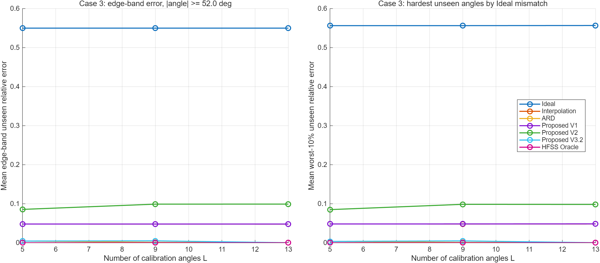

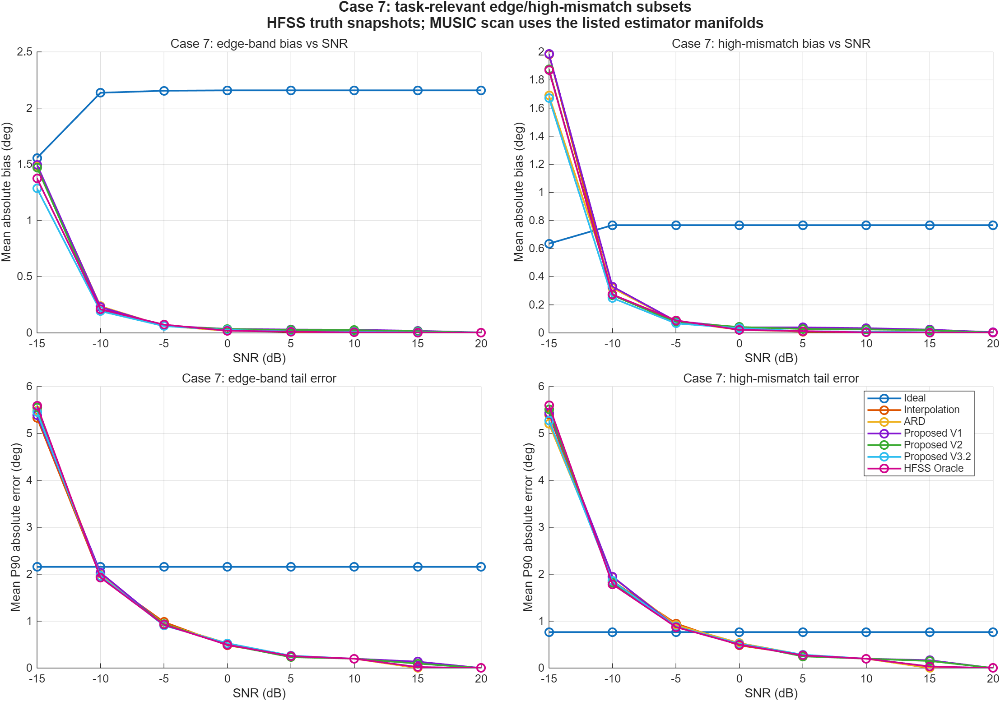

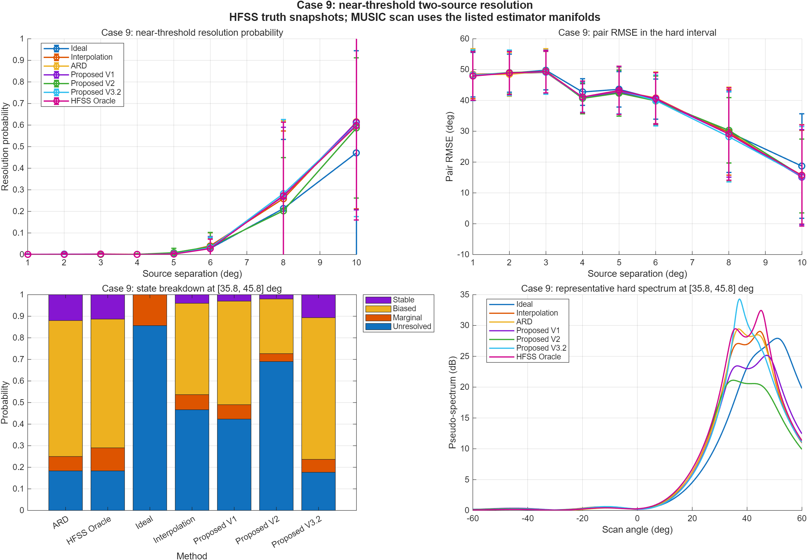

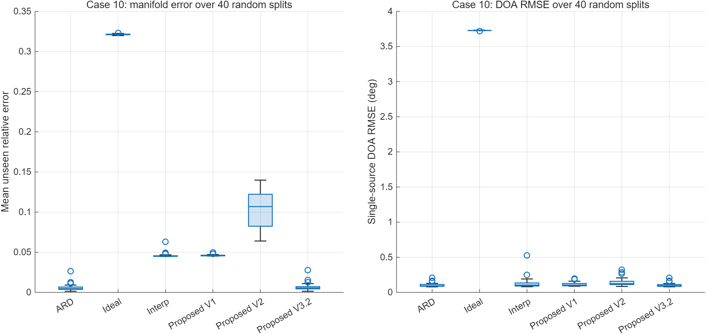

#### 决策与下一步

- 不跑 full paper profile `1:10`：V3.2 虽然把 Case 9 mean resolution 推到略高于 V1，但 stable rate 仍低于 ARD/V1，且 Case 7 单源高 SNR 退化。
- 当前 stable-neighborhood surrogate 还不等价于 `benchmark_music` 的 stable classification；下一轮需要更直接引入 snapshot/noise-aware 稳定性代理，或针对 endpoint balance / biased 状态做更接近 benchmark 的 surrogate。
- 不建议继续只靠增大 `lambdaPair` 或 SPSA iterations 硬拧；探针显示 endpoint imbalance 诊断没有随简单权重增大明显改善，容易继续牺牲 Case 3/7/10。

### 2026-04-20：`a5a22d2` Proposed V3-Revised guarded screening run

- Version hash: `a5a22d2`
- Base HEAD: `7a31dd1`
- Branch: `codex/proposed_v3`
- Worktree state at run time: uncommitted code changes; `docs/comments.md` was treated as read-only reference and not edited by this change batch.
- Run command: `run_project([3 7 9 10], default_config(pwd, 'paper'))`
- Result path: `results/a5a22d2/`
- Case outputs: `case03_unseen_generalization/`, `case07_single_source_snr/`, `case09_two_source_resolution/`, `case10_random_split_robustness/`
- Run scope: screening only; this is not a full paper-profile result.

#### 一句话结论

本轮按 `docs/comments.md` 和 review findings 将旧 V3 改成 **Calibration-Guarded ARD-Anchored Task-Aware Residual Calibration**。新版 V3-Revised 使用 calibration-null gate、trust-region residual、held-out manifold guard、coverage pair task selection 和 guard-based fallback，目标是先保住 ARD 的几何能力，再观察 Case 9 是否有任务收益。筛选结果显示：安全性修复有效，Case 3/10 不再崩；Case 7 有轻微改善；Case 9 mean resolution 略高于 ARD 但低于 V1，stable rate 也低于 ARD/V1，因此本轮不进入 full `1:10`。

#### 代码与行为变化

- `cfg.model.v3.stage` 改为 `calibration_guarded_ard_anchored_task_refinement`，默认 `lambdaAnchor = 50`、`lambdaGuard = 10`、`lambdaCal0 = 20`、`trustRadiusRad = 0.04`，task weights 和 SPSA 步长下调。
- `build_sparse_models` 中 V3 residual 现在经过 calibration-null gate、edge mask 和 `tanh` trust radius；objective 新增 `guard` 和 `cal0` 项。
- V3 fallback 不再只看内部 objective：如果 calibration drift、held-out guard excess 或 anchor RMS drift 超阈值，则 `AProposedV3` 回退为 `AARD`，并在 `v3Diagnostics.fallbackReason` 中记录原因。
- Pair task selection 从 top hard score 改为 coverage 选择，避免 task pairs 全部集中在 ±60° 边缘。
- `run_project` traceable 输出已适配新版技能：新结果写入 `results/<version-hash>/<case-name>/`，并生成 version-level `RUN_NOTES.md` 和 `manifest.md`。
- `proposed_algorithm_v3.md` 已重写为 V3-Revised 说明；旧版 V3 原样保存为 `proposed_algorithm_v3_initial_screening.md`。

#### 验证与筛选结果

- 模型级检查：`AProposedV3`、`phaseFitV3Full`、`phaseDeltaV3Full`、`v3Diagnostics` 存在，尺寸匹配 `ctx.AH`，无 `NaN/Inf`。
- `checkcode`: `default_config.m` 0 条；`src/build_sparse_models.m` 2 条既有 suppressed-message warning；`run_project.m` 14 条既有风格 warning，无阻塞项。
- V3-Revised representative objective: initial `0.886589`，final `0.816678`，`usedARDFallback = 0`。
- Guard metrics: calibration drift `1.81e-16`，guard relative excess `0.001159`，anchor RMS drift `0.001747`，均低于当前阈值。
- Case 3, `L = 9`: mean unseen error `ARD 0.001034 / V3-Revised 0.001917`，edge `0.001179 / 0.002993`，worst-10% `0.001048 / 0.002882`。相对 ARD 有小幅退化，但在 `ARD + 0.003` guard 内。
- Case 7, `SNR = 20 dB`: RMSE `ARD 0.002828 / V3-Revised 0.002309 deg`，mean absolute bias `0.000040 / 0.000027 deg`，有轻微单源收益。
- Case 9: mean resolution `ARD 0.124800 / Proposed V1 0.130000 / V3-Revised 0.126822`；mean stable rate `0.035400 / 0.037933 / 0.033933`。V3-Revised 高于 ARD 的 mean resolution `+0.002022`，但低于 V1，stable rate 也不占优。
- Case 9 leakage check: `taskEvalOverlapCount = 0`，`taskExcludedPairCount = 18`，V2/V3 task pair union 共 `22` 个；V3 task pair center mean abs 从旧 V3 的约 `57.3°` 降到 `42.87°`，更接近 evaluation 的 `38.62°`。
- Case 10: mean manifold error `ARD 0.005644 / V3-Revised 0.006080`，mean DOA RMSE `ARD 0.103499 / V3-Revised 0.103163 deg`。几何退化被控制住，DOA RMSE 略好于 ARD。

#### 关键图片

以下图片来自 `results/a5a22d2/` screening run，并已复制到 `docs/assets/`。

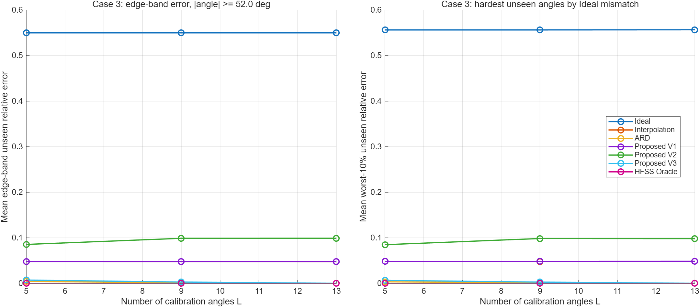


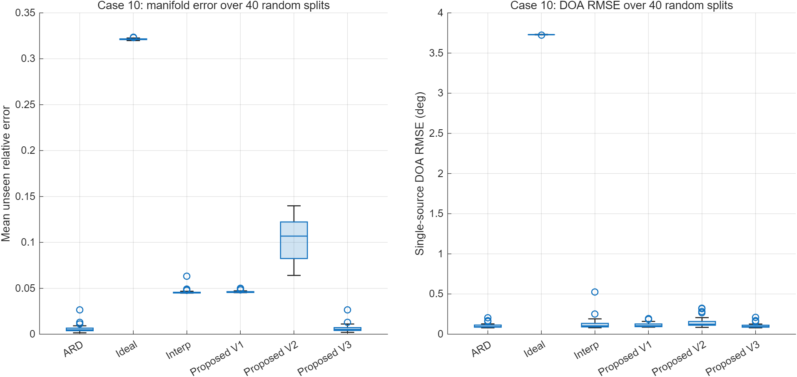

#### 决策与下一步

- 不跑 full paper profile `1:10`：V3-Revised 已经安全，但 Case 9 尚未超过 `max(ARD, V1)`，因此只能写成“安全修复有效、Case 9 收益不足”。
- 下一步应继续围绕 Case 9 的任务收益做小步调参，而不是加难 benchmark 或转 2D。
- 优先尝试：进一步改善 pair surrogate 与 `benchmark_music` resolution/stable-rate 指标的一致性，或让 coverage task pair 更贴近评估 pair 分布；同时保留当前 guard/fallback。

### 2026-04-20：`87d7f16` Proposed V3 ARD-anchored screening run

- Version hash: `87d7f16`
- Former pending local hash: `local-5a1492f8`
- Base HEAD: `489efb6`
- Branch: `codex/proposed_v3`
- Worktree state at run time: uncommitted code changes in `default_config.m`, `run_project.m`, and `src/build_sparse_models.m`.
- Run command: `run_project([3 7 9 10], default_config(pwd, 'paper'))`
- Result path pattern: `results/87d7f16/<case-name>/`
- Run scope: screening only for Case 3/7/9/10; this is not a full paper-profile result.

#### 一句话结论

本轮按 `docs/comments.md` 的下一步建议实现 **Proposed V3 = ARD coarse model + anchored task-aware phase residual refinement**。V3 初始状态严格等于 ARD，随后只优化小幅三段软门控 Chebyshev 相位 residual；训练目标包含 calibration、single-source task、pair task、midpoint suppression、ARD anchor、smooth/reg。筛选结果没有通过：V3 可运行且 task objective 下降，但它明显破坏流形重构，并且 Case 9 没有超过 ARD / Proposed V1，因此本轮不继续跑 full 1:10。

#### 代码与行为变化

- `default_config` 新增 `cfg.model.v3`，默认标签为 `Proposed V3`，`base = 'ard'`，`stage = 'ard_anchored_task_refinement'`，default `numSpsaIterations = 12`，paper profile 为 `18`。
- `build_sparse_models` 新增 `AProposedV3`、`phaseFitV3Full`、`phaseDeltaV3Full`、`phaseModelV3` 和 `v3Diagnostics`；V3 使用 `AARD .* exp(1j * DeltaPhi_task)`，不是重新拟合完整流形。
- `run_project` 在 Case 3/7/9/10 方法列表中加入 `Proposed V3`。
- Case 9 正式评估 pair 现在排除 V2/V3 task pairs 的 union，并保存 `v2TaskPairsDeg`、`v3TaskPairsDeg`、`taskPairsDeg` 和 `taskEvalOverlapCount`。
- `docs/comments.md` 仅作为只读参考，本轮未修改。

#### 验证与筛选结果

- 代码级检查：`models.AProposedV3` / `phaseFitV3Full` / `v3Diagnostics` 存在，`size(AProposedV3) == size(ctx.AH)`，无 `NaN/Inf`。
- V3 representative objective: initial `4.065220`，final `0.678386`，`usedARDFallback = 0`。
- `checkcode` 只返回既有风格类 warning：`src/build_sparse_models.m` 2 条，`run_project.m` 14 条；没有阻塞运行。
- Case 3 representative calibration guard check: max calibration-vector error `ARD 4.36e-16 / V3 2.54e-2`。这说明当前 task residual 会把校准角从 ARD/HFSS anchor 拉开，是筛选失败的关键原因之一。
- Case 3, `L = 9`: mean unseen relative error `ARD 0.001034 / V3 0.017357`，edge `0.001179 / 0.017567`，worst-10% `0.001048 / 0.017536`。V3 明显退化，未通过全局/边缘流形筛选。
- Case 7, `SNR = 20 dB`: RMSE `ARD 0.002828 / V3 0.002828 deg`，mean absolute bias `0.000040 / 0.000040 deg`。单源高 SNR 没有变坏，但也没有提供新收益。
- Case 9: mean resolution `ARD 0.124474 / Proposed V1 0.126776 / V3 0.122018`；mean stable rate `0.034825 / 0.036316 / 0.033465`。V3 低于 ARD 和 V1，未达到 `+0.003 ~ +0.005` 的筛选门槛。
- Case 9 leakage check: `taskEvalOverlapCount = 0`，`taskExcludedPairCount = 16`，V2/V3 task pair union 共 `16` 个。
- Case 10: mean manifold error `ARD 0.005644 / V3 0.065962`，mean DOA RMSE `ARD 0.103499 / V3 0.106980 deg`。RMSE 仍在 `ARD + 0.01 deg` 内，但流形误差明显崩坏。

#### 关键图片

以下图片来自 `20260420-134208-87d7f16` screening run，并已复制到 `docs/assets/`。

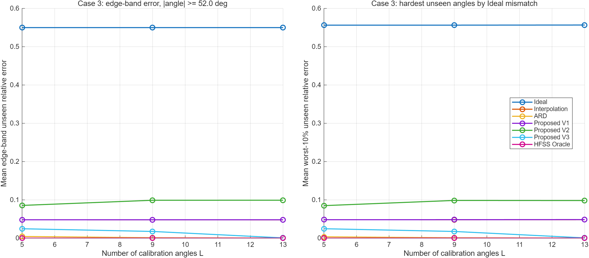

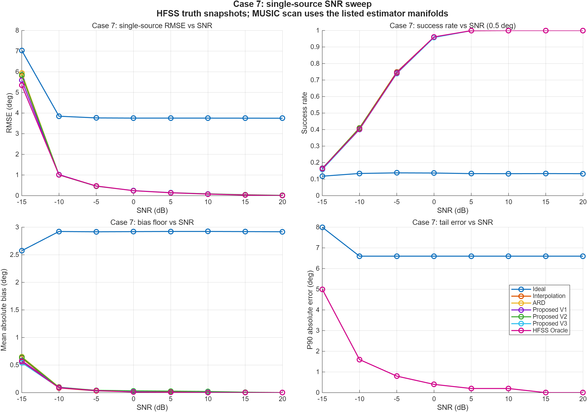


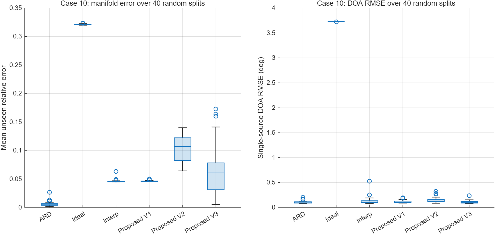

#### 决策与下一步

- 不跑 full paper profile `1:10`，因为 V3 没有通过 Case 3/9/10 的筛选标准。
- 下一轮不应加难 case 或转向 2D DOA；应先修 V3 objective，使 task residual 不再以牺牲 ARD 的全局流形为代价。
- 优先尝试更强 ARD anchor、更小 residual order/step、显式 global/edge manifold guard，或当筛选指标退化时 fallback 到 ARD。
- 本条记录只说明 V3 screening 失败，不把“实现了 V3”写成“V3 已证明优于 ARD”。

### 2026-04-20：`71650f7` ARD Method 2 同场 full paper run

- Version hash: `71650f7`
- Former pending local hash: `local-c72eabab`
- Base HEAD: `588318c`
- Branch: `codex/proposed-v2`
- Run command: `run_project(1:10, default_config(pwd, 'paper'))`
- Result path pattern: `results/71650f7/<case-name>/`
- Worktree state: this run was generated from uncommitted code/docs/results and later mapped from `local-c72eabab` to Git code commit `71650f7`; it is not a clean Git archive rerun.

#### 一句话结论

本轮把 `array_response_decomposition_algorithm.md` 中可由当前数据支持的 **ARD Method 2** 加为正式同场 baseline，并重新运行 paper profile 全部 10 个 case。ARD 使用 complex correction-vector interpolation：计算 \(g(\theta_l)=a_{\mathrm{HFSS}}(\theta_l)\oslash a_{\mathrm{ideal}}(\theta_l)\)，在 `u = sin(theta)` 域插值，再重构 \(\hat a_{\mathrm{ARD}}(\theta)=a_{\mathrm{ideal}}(\theta)\odot \hat g(\theta)\)。本轮没有实现 unknown coupling matrix `C` 的 Method 3。

#### 代码与行为变化

- `build_sparse_models` 新增 `models.AARD` 和 `models.ardModel`；ARD 在校准角数值精确穿过 HFSS，检查中最大校准角误差约 `4.36e-16`。
- `local_named_methods` 支持 `ard`，标签为 `ARD`。
- Case 3/4/7/8/9 的正式方法列表为 `Ideal / Interpolation / ARD / Proposed V1 / Proposed V2 / HFSS Oracle`。
- Case 5 的方法列表为 `ARD / Proposed V1 / Proposed V2`；Case 10 为 `Ideal / Interp / ARD / Proposed V1 / Proposed V2`。
- 先前合并脚本结果和失败结果已删除；本条记录的是同场全量重跑结果，不再使用合并版数值。

#### 全量运行与验收

- 10 个 case 均生成 `.mat`、`.png` 和 `RUN_NOTES.md`。
- Case 3/4/5/7/8/9/10 的 `.mat` 均包含 `ARD` 方法标签。
- Case 9: `taskEvalOverlapCount = 0`，最终评估 pair 数为 `152`，确认 Full V2 held-out task pairs 仍未泄漏进正式 Case 9 评估。
- 文档图片已复制到 `docs/assets/`；旧合并图片已删除。

#### 结果摘要

- Case 3 在 `L = 9` 时，mean unseen relative error 为 `Ideal 0.3210 / Interpolation 0.0447 / ARD 0.0010 / Proposed V1 0.0453 / Proposed V2 0.1054 / HFSS Oracle 0`；ARD 在流形重构指标上显著接近 Oracle。
- Case 7 在 `SNR = 20 dB` 时，RMSE 为 `Ideal 3.7502 / Interpolation 0.0016 / ARD 0.0037 / Proposed V1 0.0140 / Proposed V2 0.0114 / HFSS Oracle 0.0037 deg`。
- Case 8 在 `SNR = 10 dB, snapshots = 1000` 时，RMSE 为 `3.7545 / 0.0464 / ARD 0.0469 / 0.0606 / 0.0593 / 0.0473 deg`。
- Case 9 mean resolution 为 `Ideal 0.0987 / Interpolation 0.1262 / ARD 0.1245 / Proposed V1 0.1268 / Proposed V2 0.1148 / HFSS Oracle 0.1238`；ARD 接近 Oracle/Interpolation，但不稳定超过 Proposed V1。
- Case 10 平均 manifold error 为 `Ideal 0.3214 / Interp 0.0459 / ARD 0.0056 / Proposed V1 0.0461 / Proposed V2 0.1025`；平均 single-source RMSE 为 `3.7287 / 0.1262 / ARD 0.1035 / 0.1138 / 0.1461 deg`。

#### 关键图片

以下图片来自 `20260420-120416-71650f7` full paper-profile run，并已复制到 `docs/assets/`。

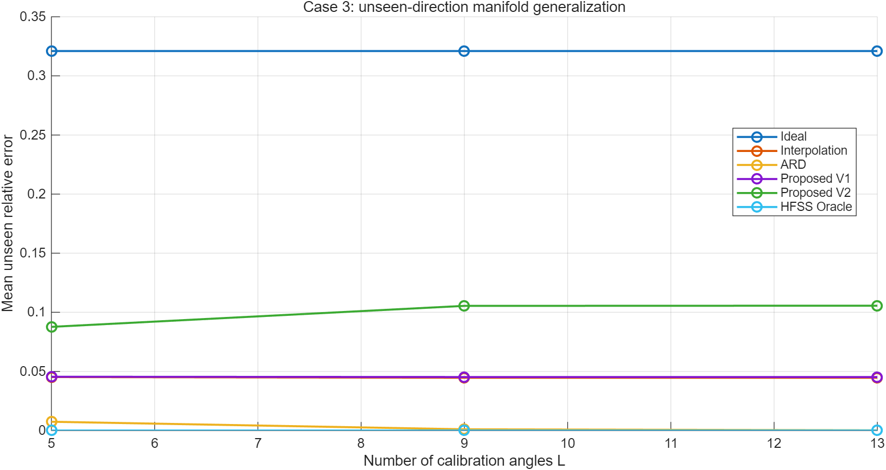

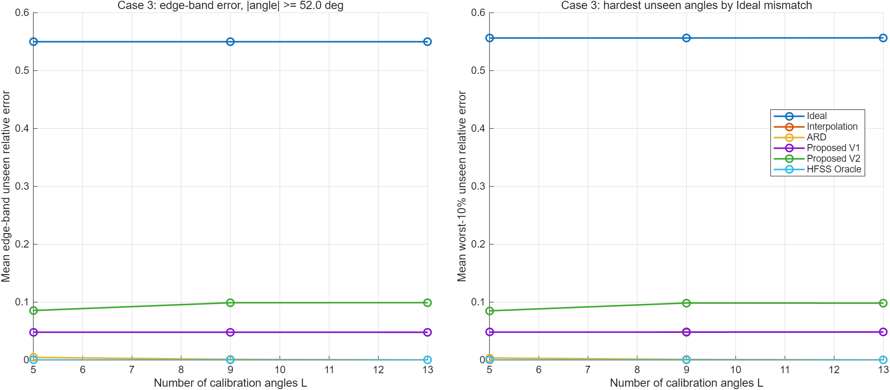

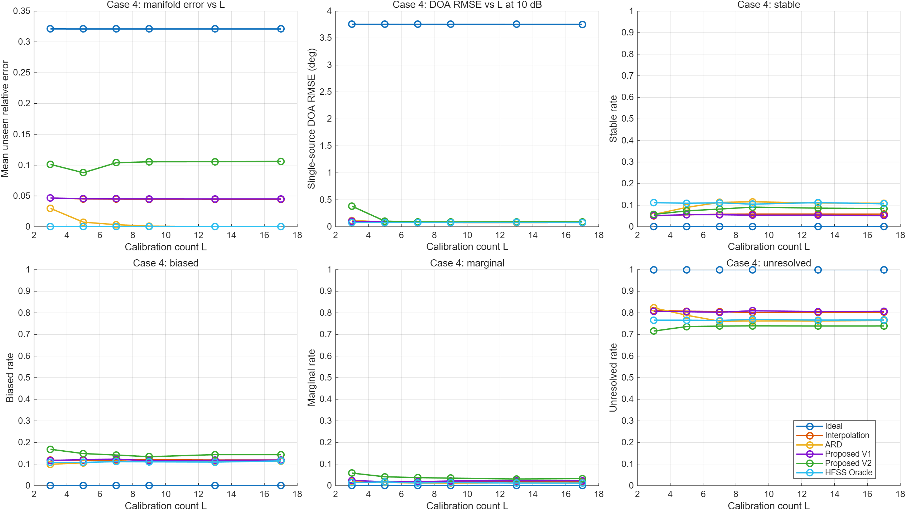

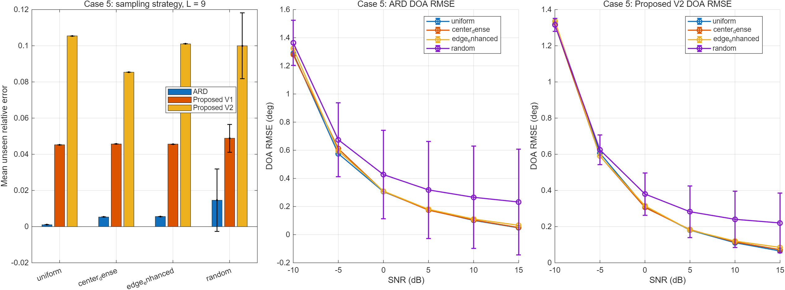

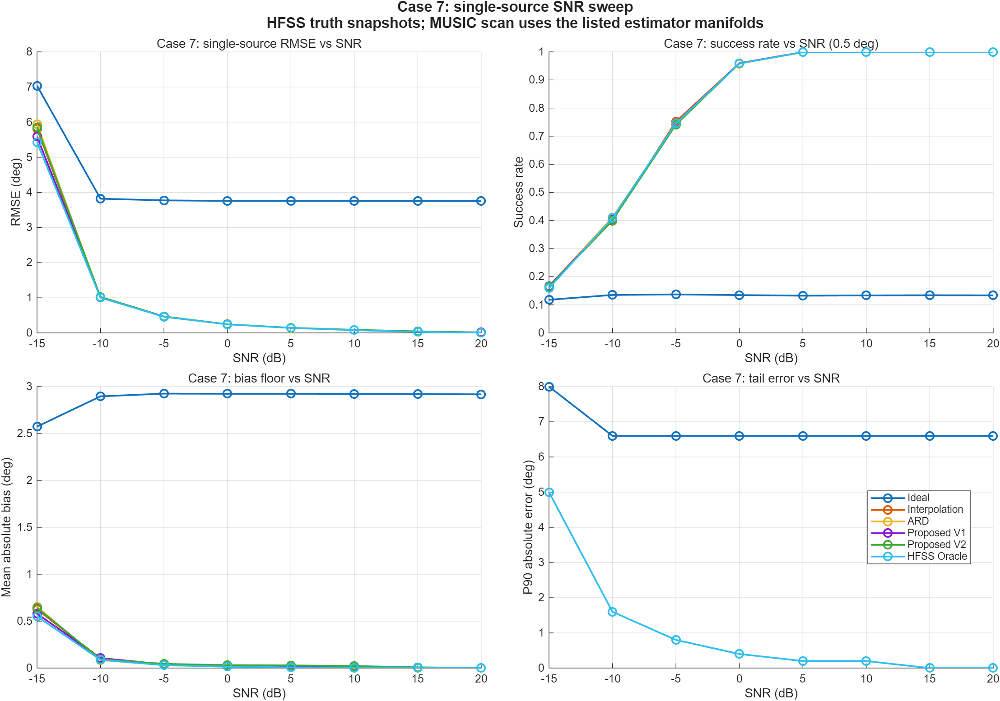

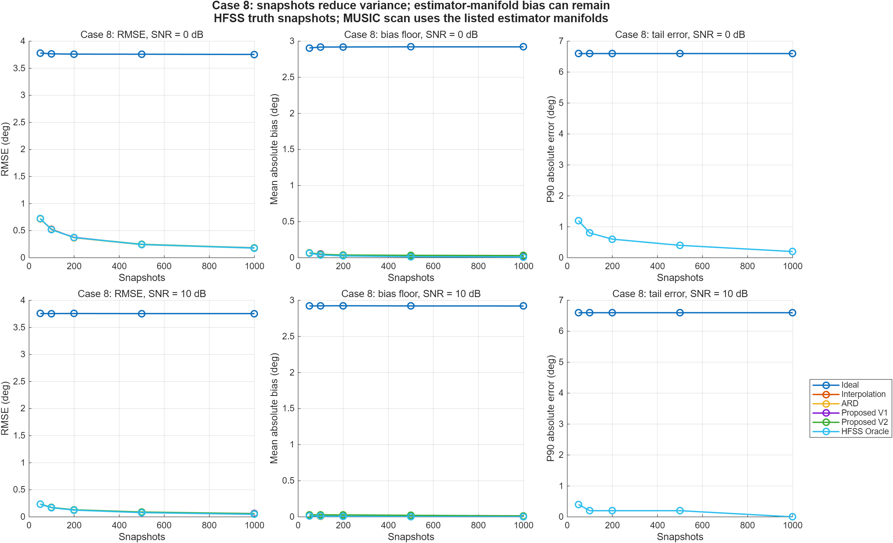

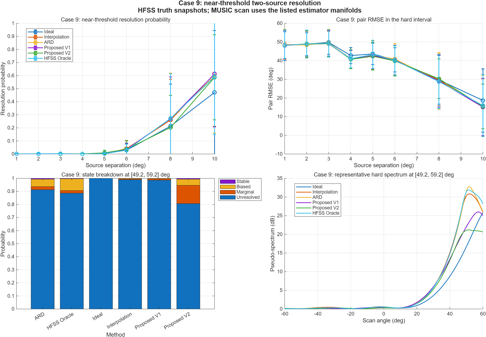

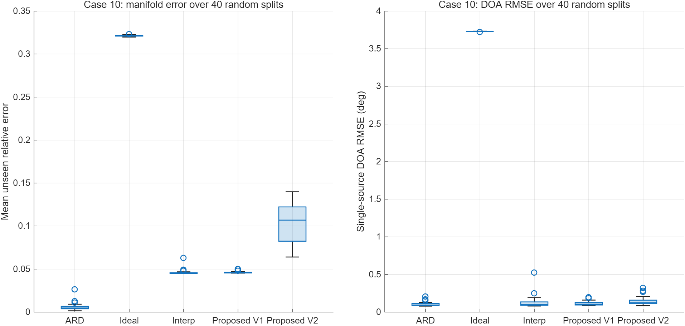

#### 仍然存在的风险或边界

- ARD Method 2 同时校正幅度和相位，因此不是当前 phase-only Interpolation 的同类对照；论文表述需要明确它是更强的 complex correction-vector baseline。
- ARD 在流形重构和 Case 10 单源随机 split 上很强，但在 Case 9 双源 resolution 上只接近 Oracle/Interpolation，并未稳定压过 Proposed V1。
- Method 3 的 coupling matrix `C` 版本仍未实现；如需声称“array response decomposition 全路线”，后续需要单独研究 `C` 的估计约束和正则化。

### 2026-04-20：`local-8e021ea7` Full V2 C-route 替代 V2-lite full paper run

- Version hash: `local-8e021ea7`
- Base HEAD: `588318c`
- Branch: `codex/proposed-v2`
- Worktree state: uncommitted code changes plus untracked reference file `C_route_full_v2_improvement_plan.md`; earlier intermediate run directories under `20260419-135127-local-aa29a0fd` were preserved.
- Run command: `run_project(1:10, default_config(pwd, 'paper'))`
- Result path pattern: `results/local-8e021ea7/<case-name>/`
- Run scope: all 10 cases, paper profile, no smoke run.

#### 一句话结论

本轮把公开标签 `Proposed V2` 从 V2-lite 替换为 **Full V2 C-route**：三段软门控相位模型保留为 Stage-I initializer，最终 `AProposedV2` 经过 held-out HFSS 单源/双源 task loss 的 SPSA + Adam-moment 细化。Full V2 已经完成可追溯全量运行，但结果没有稳定优于 `Interpolation` 或 `Proposed V1`，因此论文表述必须收窄为“已实现并验证 task-supervised Full V2 路线，目前证据不足以声称 V2 全局最优”。

#### 代码与行为变化

- `default_config` 中 `cfg.model.v2.stage = 'full'`，`pairTaskEnabled = true`，paper profile 使用 `numSpsaIterations = 24`。
- `build_sparse_models` 现在保留 `AProposedV2Init` / `phaseFitV2InitFull` 作为 Stage-I 回看字段，`AProposedV2` / `phaseFitV2Full` 则保存 Full V2 任务细化后的结果。
- Full V2 objective 包含 complex calibration、smooth/reg、single-source subspace/peak、pair subspace/peak 和 midpoint suppression；训练协方差使用 HFSS truth exact covariance，不使用随机 snapshots。
- `v2Diagnostics` 保存 held-out single angles、task pairs、objective weights、objective history、initial/final objective 和是否 fallback 到 initializer。
- Case 9 在正式评估 pair 中排除 `models.v2Diagnostics.taskPairsDeg`，结果保存 `taskPairsDeg`、`taskExcludedPairCount` 和 `taskEvalOverlapCount`。
- Case 3 新增 edge-band unseen error 与 worst-10% unseen error；Case 6 改为 Full V2 task hyperparameter sensitivity；Case 7/8 新增 edge/high-mismatch 子集 RMSE、mean absolute bias 和 P90 absolute error。

#### 全量运行与验收

- 10 个 case 均生成 `.mat`、`.png` 和 `RUN_NOTES.md`。
- Case 3/4/7/8/9 的方法标签包含 `Ideal / Interpolation / Proposed V1 / Proposed V2 / HFSS Oracle`；Case 10 使用 `Ideal / Interp / Proposed V1 / Proposed V2`。
- Case 9: `taskExcludedPairCount = 16`，`taskEvalOverlapCount = 0`，最终评估 pair 数为 `152`，确认 held-out pair task 没有泄漏进正式 Case 9 评估。
- 中间 run `local-aa29a0fd` 跑完了 10 个 case，但 Case 9 的 `taskEvalOverlapCount` 字段当时记录的是“排除数量”而不是“最终重叠数量”；代码修正后使用 `local-8e021ea7` 重新全量运行，本条只把 `local-8e021ea7` 作为有效验收 run。

#### 结果摘要

- Case 3 在 `L = 9` 时，mean unseen relative error 为 `Ideal 0.3210 / Interpolation 0.0447 / Proposed V1 0.0453 / Proposed V2 0.1054 / HFSS Oracle 0`；edge-band error 为 `0.5499 / 0.0479 / 0.0480 / 0.0990 / 0`。
- Case 7 在 `SNR = 20 dB` 时，RMSE 为 `Ideal 3.7501 / Interpolation 0.0043 / Proposed V1 0.0137 / Proposed V2 0.0136 / HFSS Oracle 0.0043 deg`。
- Case 8 在 `SNR = 10 dB, snapshots = 1000` 时，RMSE 为 `3.7542 / 0.0466 / 0.0596 / 0.0619 / 0.0464 deg`。
- Case 9 mean resolution 为 `Ideal 0.0987 / Interpolation 0.1262 / Proposed V1 0.1274 / Proposed V2 0.1168 / HFSS Oracle 0.1231`；mean stable rate 为 `0.0057 / 0.0370 / 0.0359 / 0.0243 / 0.0336`。
- Case 10 平均 manifold error 为 `Ideal 0.3214 / Interp 0.0459 / Proposed V1 0.0461 / Proposed V2 0.1025`；平均 single-source RMSE 为 `3.7287 / 0.1262 / 0.1138 / 0.1457 deg`。

#### 关键图片

以下图片来自 `20260420-091822-local-8e021ea7` full paper-profile run，并已复制到 `docs/assets/`。

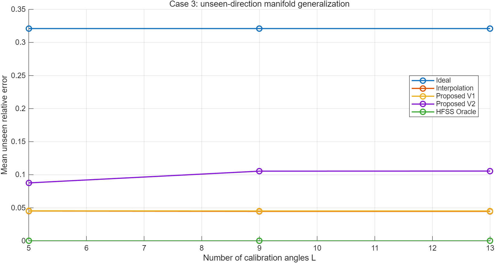

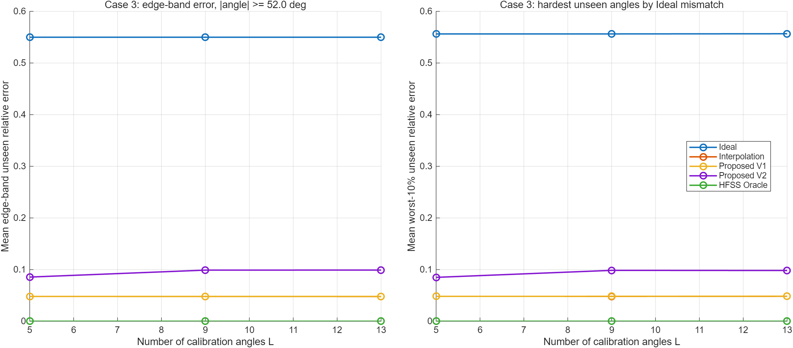

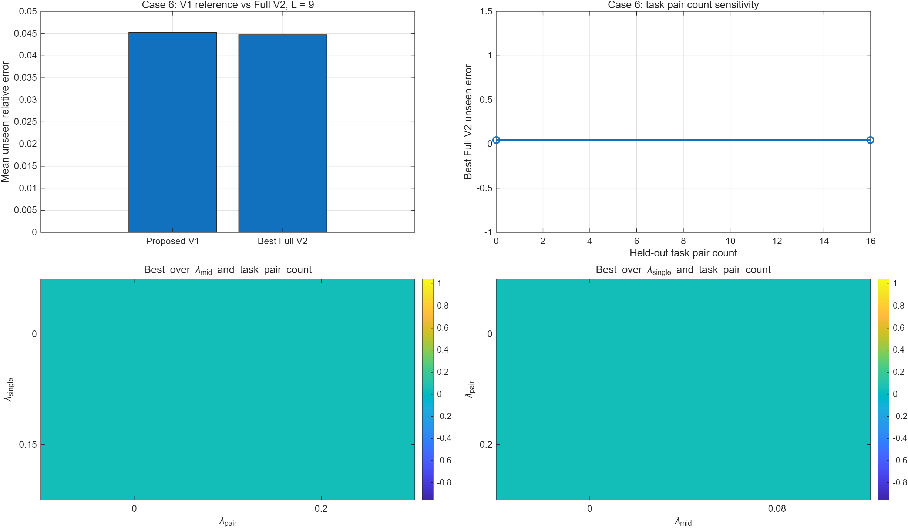

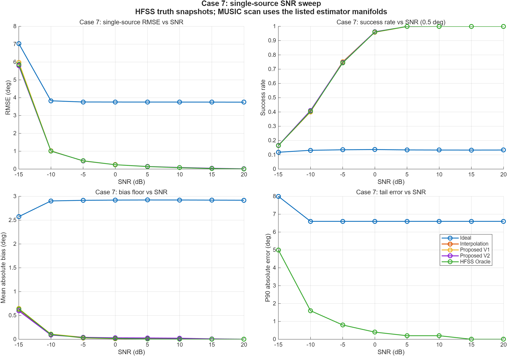

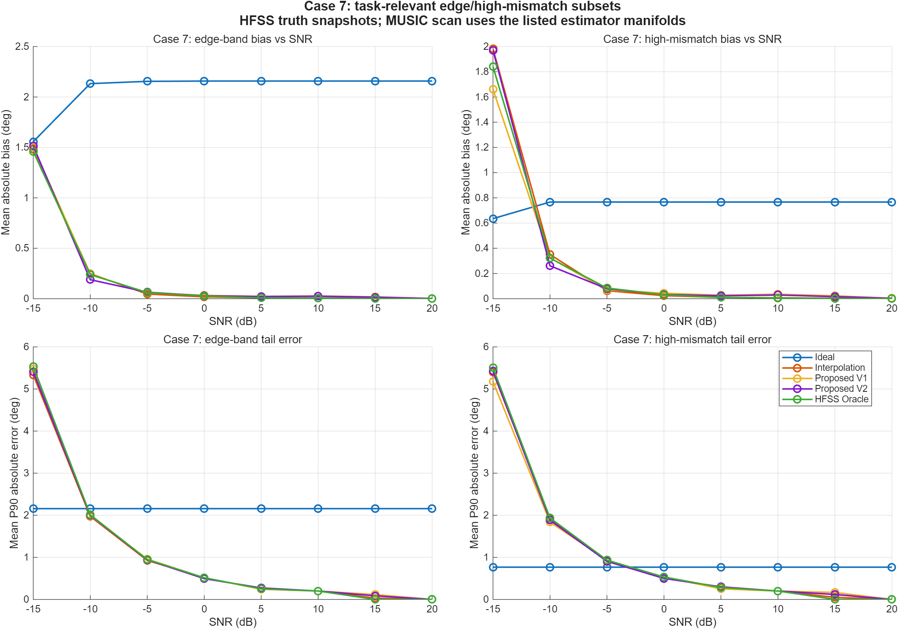

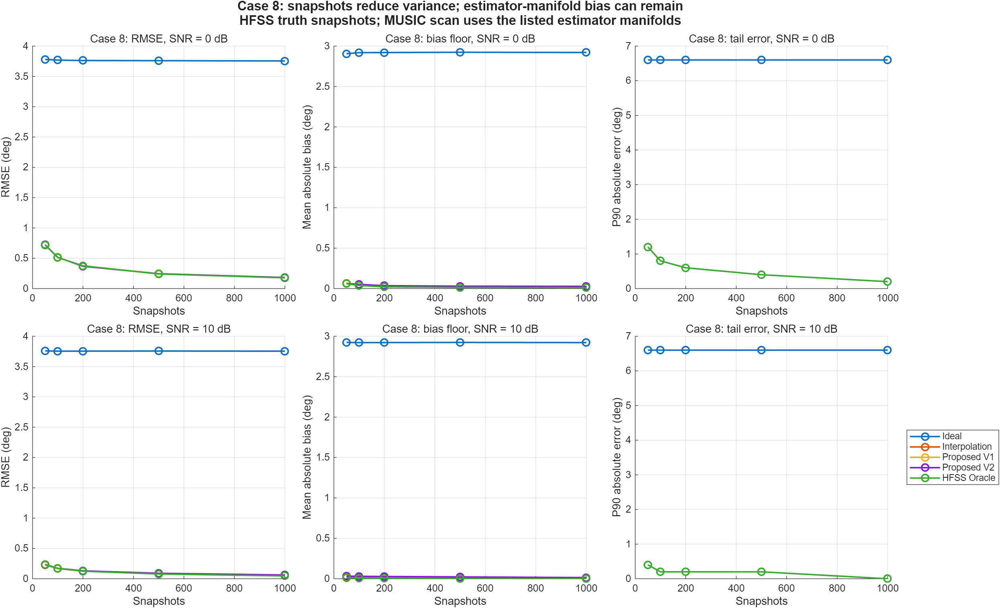

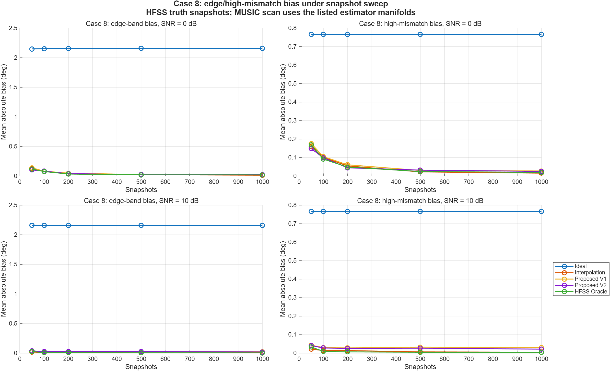

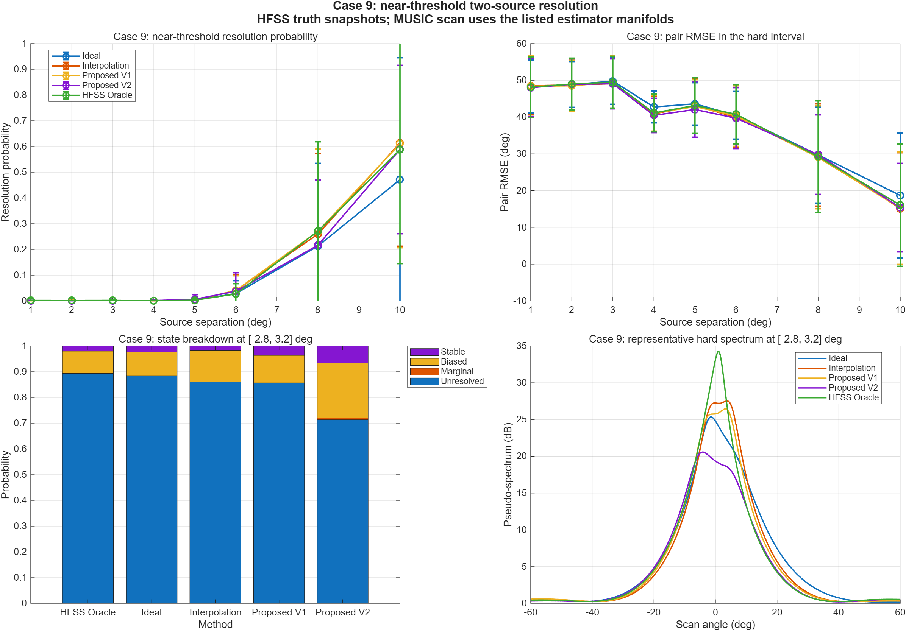

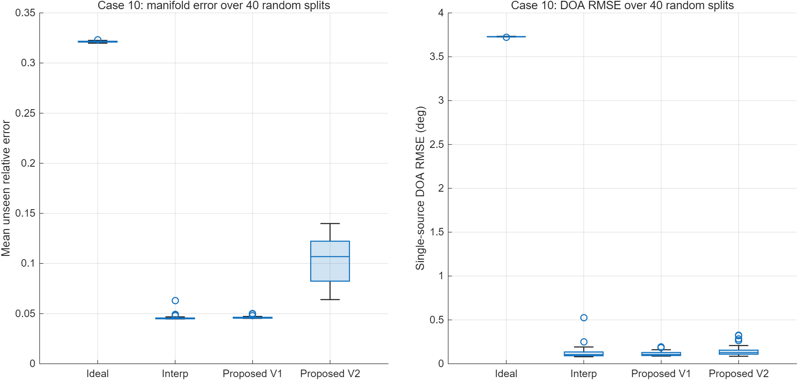

#### 仍然存在的风险或边界

- Full V2 使用 `heldout_hfss` task set，因此它是更强的 task-supervised 方法，不再与 `Interpolation` / `Proposed V1` 完全同预算。
- 当前 Full V2 在 Case 3/8/9/10 没有稳定胜过 V1 或 Interpolation，尤其 Case 9 mean resolution 和 stable rate 均低于 V1；论文主张需要据此收窄。
- 本轮没有连续优化 gate centers/beta，只优化固定门控结构下的分段 Chebyshev 系数；如果继续走 C-route，下一步应优先诊断 task loss 权重和 pair task 是否把单源/流形泛化拉坏。
- 当前结果来自 dirty worktree 的 pending local hash；上传同步时需要由 `project-github-sync` 把 `local-8e021ea7` 替换为真实 Git commit hash。

### 2026-04-19：`2962bc3` Proposed-v2 Lite 与 V1 对照 full paper run

- Former pending local hash: mapped to Git code commit `2962bc3`
- Base HEAD: `b703792`
- Branch: `codex/proposed-v2`
- Worktree state: uncommitted code/docs changes; existing `docs/comments.md` and untracked `docs/v1实验结果分析.md` were preserved.
- Run command: `run_project(1:10, default_config(pwd, 'paper'))`
- Result path pattern: `results/2962bc3/<case-name>/`
- Failed launch logs before final run: `results/2962bc3/logs/full-run-20260419-122739-2962bc3.*` and `results/2962bc3/logs/full-run-20260419-122900-2962bc3.*`; both failed before any case result directory was created because of MATLAB `-batch` quoting / temp script naming.
- Run scope: all 10 cases, paper profile, no smoke run.

#### 一句话结论

本轮按 `proposed_algorithm_v2.md` 落地的是 **Proposed-v2 Lite**，不是 Full V2：代码新增边缘感知三段软分段相位残差模型，并用确定性的单源 MUSIC surrogate 从小候选集中选择 V2 参数；双源 pair task 优化只保留为关闭配置。全量 paper run 已完成，结果中同时保留 `Proposed V1` 与 `Proposed V2`。

#### 代码与行为变化

- `build_sparse_models` 保留现有全局 Chebyshev 残差模型作为 `Proposed V1`，并新增 `AProposedV2`、`phaseFitV2Full`、`phaseModelV2`、`v2Diagnostics`。
- V2-lite 在 `u = sin(theta)` 域使用左边缘、中心、右边缘三段软门控局部 Chebyshev 基；校准点权重为 mismatch score 与 edge score 的组合。
- `cfg.model.v2` 默认启用：`stage = lite`、`segmentCentersDeg = [-50 0 50]`、`order = 2`、`candidateMismatchWeights = [1 2 4]`、`candidateEdgeWeights = [0.5 1 2]`、`taskWeight = 0.25`、`pairTaskEnabled = false`。
- Case 3/4/7/8/9/10 的关键对比扩展为 `Ideal / Interpolation / Proposed V1 / Proposed V2 / HFSS Oracle`；Case 10 使用 `Ideal / Interp / Proposed V1 / Proposed V2`。
- Case 5 同时保存并绘制 V1/V2 在不同 calibration strategy 下的 manifold error 与 DOA RMSE。
- Case 6 同时输出 V1/V2 的模型敏感性，用来判断 V2-lite 是否只是普通阶数/正则调参。
- Case 9 保留 near-threshold pair 设计，代表性 pair 选择现在优先解释 `Proposed V2` 相对 `Interpolation / Proposed V1` 的优势或失败。

#### 全量结果摘要

- Case 3 的 mean unseen relative error 在 `L = 9` 时为 `Ideal 0.3210 / Interpolation 0.0447 / Proposed V1 0.0453 / Proposed V2 0.0447 / Oracle 0`，V2-lite 与 Interpolation 接近，并小幅优于 V1。
- Case 6 的最佳 unseen relative error 为 `Proposed V1 0.0449 / Proposed V2 0.0447`，说明 V2-lite 收益很小，但不是明显退化。
- Case 7 在 `SNR = 20 dB` 时，RMSE 为 `Ideal 3.7501 / Interpolation 0.0043 / Proposed V1 0.0137 / Proposed V2 0.0085 / HFSS Oracle 0.0043 deg`；mean absolute bias 为 `2.9179 / 0.0001 / 0.0009 / 0.0004 / 0.0001 deg`。
- Case 8 在 `SNR = 10 dB, snapshots = 1000` 时，RMSE 为 `3.7542 / 0.0466 / 0.0596 / 0.0524 / 0.0464 deg`，mean absolute bias 为 `2.9220 / 0.0024 / 0.0133 / 0.0066 / 0.0020 deg`。
- Case 9 的代表性困难 pair 为 `[35.8, 45.8] deg`，选择原因是 `Proposed V2` 相比 `Interpolation / Proposed V1` 在该 mixed hard pair 上改善 stable/resolution 行为。
- Case 9 在 `10 deg` separation 下，resolution mean 为 `Ideal 0.4748 / Interpolation 0.6192 / Proposed V1 0.6148 / Proposed V2 0.6246 / HFSS Oracle 0.5944`，pair RMSE mean 为 `18.6304 / 14.9388 / 15.0744 / 14.7468 / 15.7154 deg`。
- Case 9 在 `8 deg` separation 下，`Proposed V2` 的 resolution mean 为 `0.2632`，低于 `Interpolation 0.2711` 和 `Proposed V1 0.2694`；因此不能写成 V2 全局稳定优于所有 baseline。
- Case 10 的平均 manifold error 为 `Ideal 0.3214 / Interp 0.0459 / Proposed V1 0.0461 / Proposed V2 0.0456`；平均 single-source RMSE 为 `3.7287 / 0.1262 / 0.1138 / 0.1363 deg`。V2 在流形误差上略优，但 DOA RMSE 不稳定优于 V1/Interpolation。

#### 关键图片

以下图片来自 `20260419-123007-2962bc3` full paper-profile run，并已复制到 `docs/assets/`。

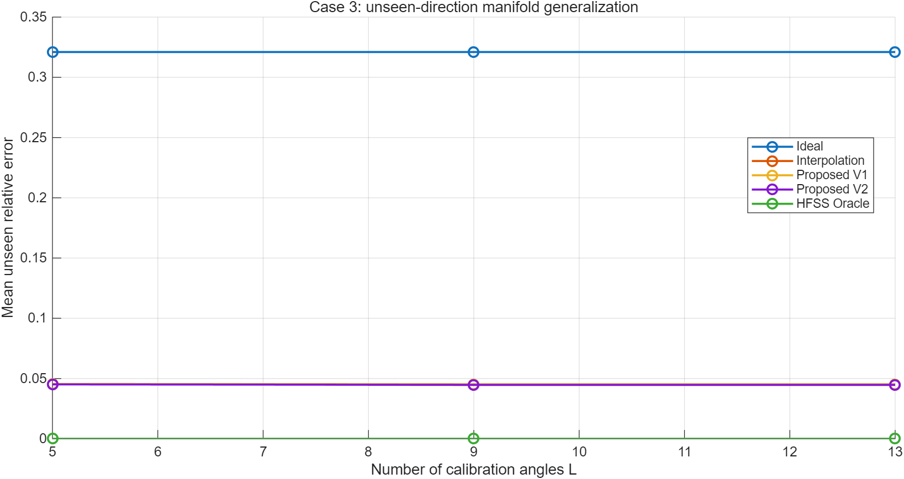

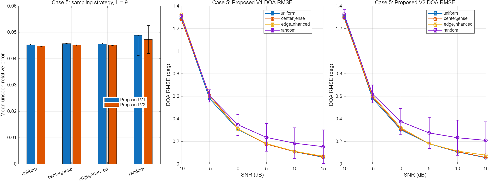

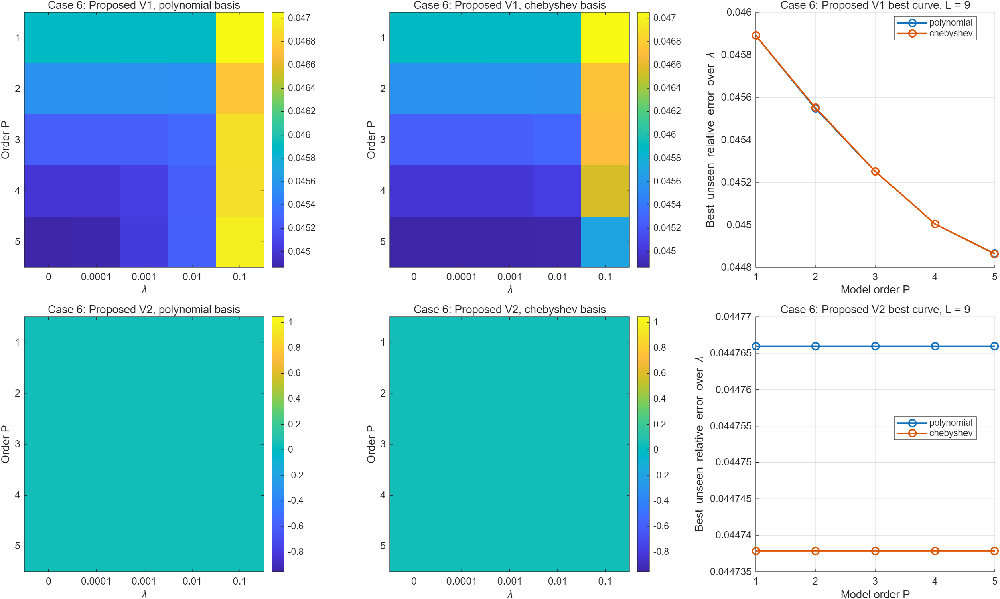

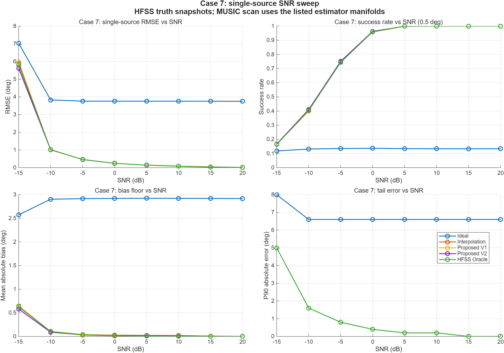

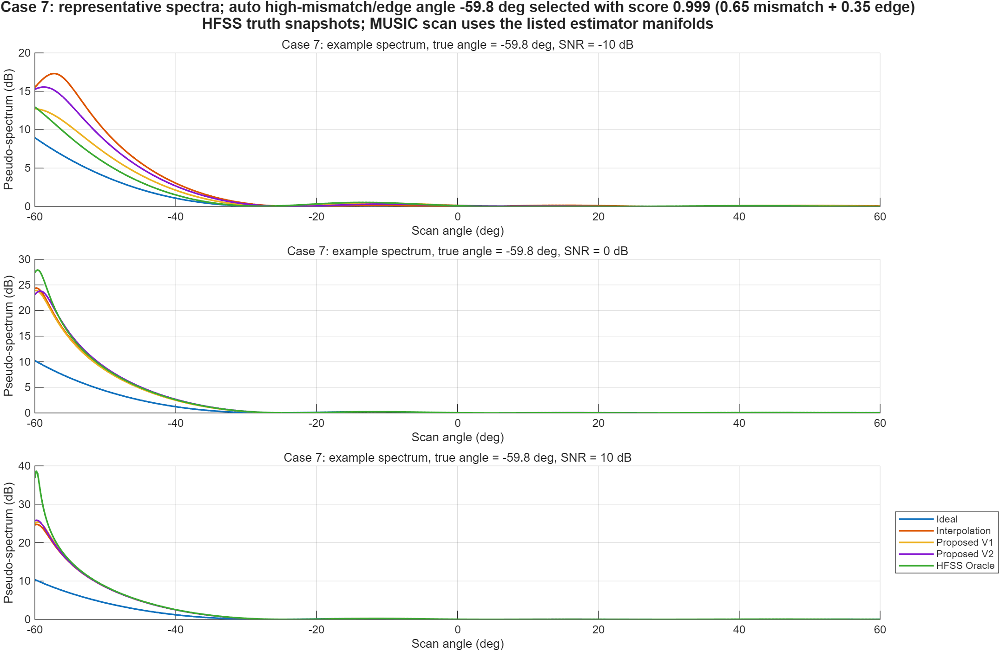

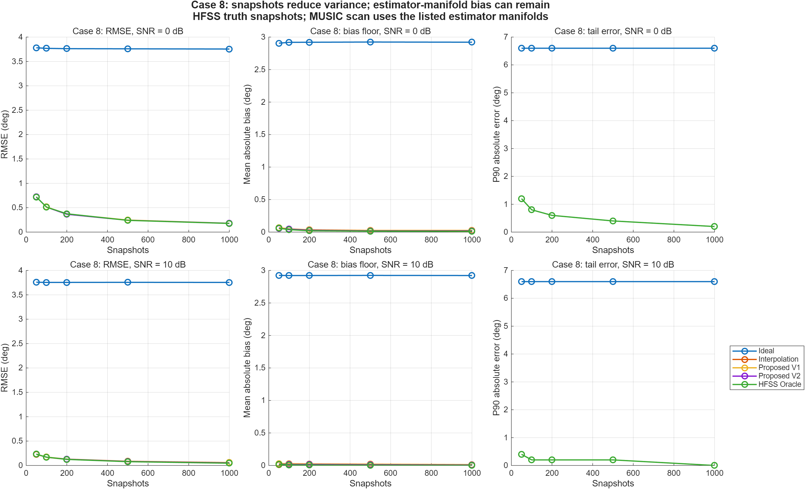

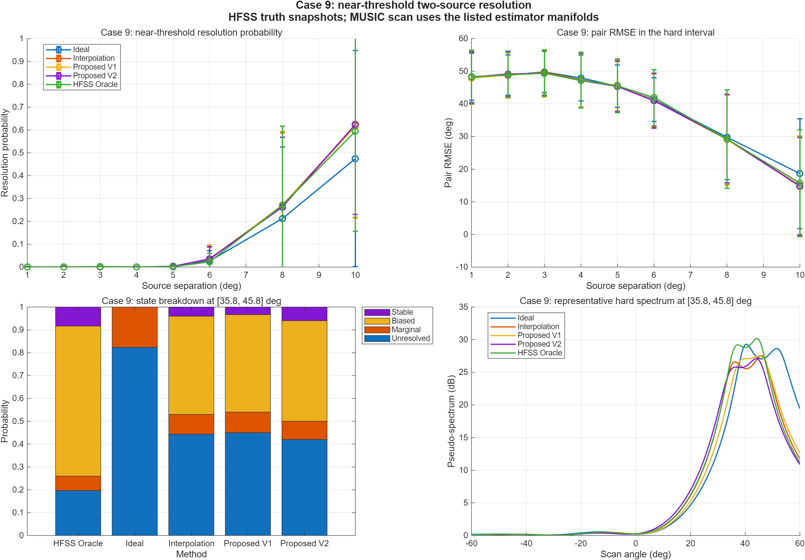

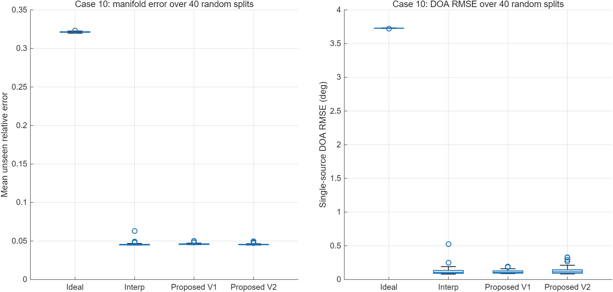

#### 仍然存在的风险或边界

- `2962bc3` 是本批结果映射后的 Git code commit hash；本轮结果来自 uncommitted worktree，不能冒充 clean repo final archive。
- 本轮实现的是 V2-lite，未启用文档中 Full V2 的双源 pair task 优化、L-BFGS/Adam 迭代或完整 task loss。
- V2-lite 在部分流形指标和部分高 SNR / 高 snapshots 单源指标上改善 V1，但在 Case 9/10 上没有形成稳定全局优势。
- 论文表述应收窄为：V2-lite 提供了一个可检验的新建模方向，并在若干指标上缓解 V1 的边缘/高失配问题；不能写成 Full V2 已验证，也不能写成 V2 稳定压过 Interpolation。

### 2026-04-18：`f4e46e4` Case 4 严格公共测试集与全量 paper run

- Git code commit hash: `f4e46e4`
- Former pending local hash: `local-3e814f40`
- Base HEAD: `bd11394`
- Worktree state: uncommitted code changes; existing historical result deletions and prior local archive artifacts were preserved.
- Run command: `run_project(1:10, default_config(pwd, 'paper'))`
- Result path pattern: `results/f4e46e4/<case-name>/`
- Run scope: all 10 cases, paper profile.

#### 一句话结论

本轮保留 harder Case 4，不退回旧宽间隔双源版本；同时把 Case 4 改成“只比较 L”的严格公共测试集版本，并把右侧双源图从单一 stable probability 扩成 `stable / biased / marginal / unresolved` 四状态分解。随后用同一个 pending hash 跑完 10 个 case 的全量 paper-profile 结果，便于统一管理。

#### 代码与行为变化

- Case 4 默认 `monteCarlo` 提高到 `200`，paper profile 也保持 `case4.monteCarlo = 200`。
- Case 4 继续使用 harder near-threshold sweep：`separationSweepDeg = [4 5 6 8 10]`，每个 separation 最多 `8` 个 pair，`pairSelectionMode = research_coverage`。
- 新增 `cfg.case4.useCommonTestSet = true`。Case 4 会先收集所有 `L = [3 5 7 9 13 17]` 的 uniform calibration angles，并在这些角之外固定公共单源测试角和公共双源 pair。
- Case 4 每个 L 都使用同一组 `commonSingleAnglesDeg` 和 `commonSourcePairsDeg`，从而把变量收紧到校准数量 L 本身。
- Case 4 结果新增 `stableRate`、`biasedRate`、`marginalRate`、`unresolvedRate`、`commonSingleAnglesDeg`、`commonSourcePairsDeg`、`commonExcludedCalibrationAnglesDeg` 和 `useCommonTestSet`。
- Case 4 图改成 `2 x 3` 布局：manifold error、single-source RMSE、stable、biased、marginal、unresolved。
- `cfg.case1.exampleAngleDeg = 25` 保留为同一行 manual fallback 注释；默认 Case 1 仍由 high-SNR sweep 自动选择 stress angle。

#### 全量运行结果检查

- 10 个 case 均生成 `20260418-195622-f4e46e4` 目录。
- 10 个 case 均生成 `RUN_NOTES.md`。
- Case 4 使用公共测试集：`useCommonTestSet = 1`。
- Case 4 公共双源 pair 数：`40`；每个 L 的 `sourcePairCount` 均为 `40`。
- Case 4 公共单源测试角数：`75`；所有 L 的校准角并集排除数：`25`。
- Case 4 full run 的 stable rate roughly 为：
  - Ideal: 全部约 `0`
  - Interpolation: `0.0560-0.0607`
  - Proposed: `0.0516-0.0561`
  - HFSS Oracle: `0.1032-0.1119`
- Case 4 unresolved rate roughly 为：
  - Ideal: 约 `0.9998-1.0000`
  - Interpolation: `0.7986-0.8081`
  - Proposed: `0.8033-0.8085`
  - HFSS Oracle: `0.7649-0.7711`
- Case 9 仍包含 `Ideal / Interpolation / Proposed / HFSS Oracle`，共 `168` 个 pair、`8` 个 separation，代表困难 pair 为 `[-38.4, -30.4] deg`。

#### 关键图片

以下图片来自 `20260418-195622-f4e46e4` 全量 paper-profile run，并已复制到 `docs/assets/`。

旧分支图片已从本分支删除：`assets/case01-mismatch-floor-paper-f4e46e4.png`

旧分支图片已从本分支删除：`assets/case04-calibration-count-paper-f4e46e4.png`

旧分支图片已从本分支删除：`assets/case07-snr-metrics-paper-f4e46e4.png`

旧分支图片已从本分支删除：`assets/case08-snapshot-metrics-paper-f4e46e4.png`

旧分支图片已从本分支删除：`assets/case09-resolution-paper-f4e46e4.png`

#### 仍然存在的风险或边界

- `local-3e814f40` 已在本次同步中映射为 Git code commit hash `f4e46e4`。
- 本轮 full run 原始生成时来自 uncommitted worktree；它是 traceable paper-profile run，但仍不是 clean repo final archive。
- Case 4 已经不再“太容易”，但现在双源分辨很难；它更适合作为 calibration count 的严格压力测试，双源主证据仍应以 Case 9 为主。
- Case 4 中 Proposed 与 Interpolation 在四状态统计上非常接近，论文不能写成 Proposed 在该 case 中明显压过 Interpolation。

### 2026-04-18：`local-7fa085bd` 按 comments 收紧 Case 4 双源难度

- Version hash: `local-7fa085bd`
- Base HEAD: `bd11394`
- Worktree state: uncommitted code changes; previous result deletions and local archive artifacts are preserved.
- Change reason: `docs/comments.md` 指出 `case1.exampleAngleDeg = 25` 仍像主配置，且 Case 4 旧双源 pair 太容易，`Interpolation / Proposed / Oracle` 基本饱和到 1。
- Affected cases: Case 1 config readability, Case 4 calibration-count sensitivity.
- Result path: `results/local-7fa085bd/case04_calibration_count_sensitivity/`

#### 代码与行为变化

- `cfg.case1.exampleAngleDeg = 25` 改为同一行注释，明确它只是 manual fallback；默认 Case 1 仍由 high-SNR sweep 自动选择 stress angle。
- Case 4 的双源部分不再使用旧的宽间隔对称 pair `[-5,5] / [-10,10] / [-15,15] / [-20,20]`。
- Case 4 现在使用 `separationSweepDeg = [4 5 6 8 10]`，每个 separation 最多选 `8` 个 pair，并复用 Case 9 的 `research_coverage` 评分逻辑覆盖高失配、边缘和远离校准角的组合。
- Case 4 结果新增 `sourcePairCount`，每个 L 的 `perL` 中保存实际 `sourcePairsDeg` 和 `pairSelection`，便于回看双源样例来源。
- Case 4 图中第三栏改成 `Stable resolution probability`，标题改成 near-threshold two-source resolution，避免把它误读成旧版宽间隔演示。
- `paper` profile 将 `case4.monteCarlo` 提到 `120`，因为近阈值概率比旧宽间隔 pair 更需要厚一点的统计。

#### Smoke 验证

已跑低 Monte Carlo traceable smoke：

```matlab
run_project(4, cfgSmoke)
```

验证配置只用于链路检查：`lValues = [3 9 17]`，`monteCarlo = 8`。结果确认：

- 每个 L 自动选出 `40` 个双源 pair。
- 第一档 L 的 pair separation 覆盖 `[4.0, 10.0] deg`。
- `pairSelection.mode = case4_research_coverage`。
- `resolutionProb` 不再像旧 Case 4 那样在修正方法上饱和为 1；本次 smoke 中 corrected/oracle 方法约落在 `0.04-0.11`，而 Ideal 为 `0`。由于 MC 很低，这只能说明难度区间已被收紧，不能当作正式统计数值。

旧分支图片已从本分支删除：`assets/case04-near-threshold-smoke-local-7fa085bd.png`

#### 仍然存在的风险或边界

- 本次只按 comments 做局部代码收口，没有升级 Case 5 / Case 6 的实验结构。
- Case 4 现在避免了“太容易”，但 smoke 结果偏难；正式论文是否采用它作为主图仍需 paper profile 或更厚 MC 复核。
- Case 4 仍应定位为校准数量敏感性和辅助证据；真正的双源分辨主证据仍是 Case 9。

### 2026-04-18：`local-77d2252a` 本地收口归档候选 full paper run

- Pending local hash: `local-77d2252a`
- Base HEAD: `bd11394`
- Worktree state: uncommitted local closeout run; tracked historical `results*` deletions are intentionally preserved per user confirmation.
- Run command: `run_project(1:10, default_config(pwd, 'paper'))`
- Result path pattern: `results/local-77d2252a/<case-name>/`
- Comment/review status: `docs/comments.md` is a current local project-completeness analysis, not a hash-matched review verdict.

#### 一句话结论

本轮按“收口归档”路线处理：不扩模型、不重写 Case 9 核心算法，先完成文本统一、legacy 配置说明、traceable full paper-profile run 和 `docs/assets/` 图像归档。当前结果可用于本地研究判断和 issue 收口，但仍是 pending local hash，不是最终 clean Git 归档。

#### 代码与行为变化

- 图题统一到 `HFSS truth snapshots; MUSIC scan uses the listed estimator manifolds`，避免 singular/plural 和 truth/estimator 表述混用。
- `case1.exampleAngleDeg = 25` 保留为 manual fallback，并在配置中注明默认 Case 1 仍由 high-SNR sweep 自动选择 stress angle。
- Case 9 保留现有 near-threshold + research_coverage + `Interpolation` baseline 设计，没有在本轮引入新算法变量。
- Case 4 / Case 5 / Case 6 的深层升级只在文档中标为后续阶段，不在 clean 归档前扩大代码改动面。

#### 全量结果摘要

- Case 7 在 `SNR = 20 dB` 时，`Ideal / Interpolation / Proposed / HFSS Oracle` 的 RMSE 约为 `3.7507 / 0.0037 / 0.0123 / 0.0043 deg`；mean absolute bias 约为 `2.9180 / 0.0001 / 0.0008 / 0.0001 deg`；P90 absolute error 约为 `6.6000 / 0.0000 / 0.0000 / 0.0000 deg`。Ideal 的 high-SNR mismatch floor 仍然清楚。
- Case 8 在 `SNR = 10 dB, snapshots = 1000` 时，`Ideal / Interpolation / Proposed / HFSS Oracle` 的 RMSE 约为 `3.7545 / 0.0455 / 0.0594 / 0.0473 deg`；mean absolute bias 约为 `2.9214 / 0.0027 / 0.0129 / 0.0023 deg`；P90 absolute error 约为 `6.6000 / 0.0000 / 0.0000 / 0.0000 deg`。这继续支持“快拍数增加不能自动修复错误流形”的表述。
- Case 9 的方法标签已确认为 `Ideal / Interpolation / Proposed / HFSS Oracle`，每个 separation 都有代表性 pair 和状态分级字段。
- Case 9 本次代表性困难 pair 为 `[-38.4, -30.4] deg`，选择原因是 `Proposed` 相比 `Interpolation` 在该 pair 上改善 stable/resolution 行为，同时仍是 mixed hard pair。
- Case 9 在 `10 deg` separation 下 resolution mean 约为 `Ideal 0.4748 / Interpolation 0.6192 / Proposed 0.6148 / HFSS Oracle 0.5887`，pair RMSE mean 约为 `18.6304 / 14.9388 / 15.0744 / 16.0637 deg`，stable mean 约为 `0.0243 / 0.1989 / 0.1933 / 0.1870`。因此双源结论仍应保持克制，不能写成 Proposed 全局稳定优于 Interpolation。

#### 关键图片

以下图片来自 `20260418-190723-local-77d2252a` 本地 paper-profile full run，并已复制到 `docs/assets/`。它们可用于当前研究日志和 issue 收口，但最终论文归档仍需真实 Git hash 或 clean rerun 对齐。

旧分支图片已从本分支删除：`assets/case01-mismatch-floor-paper-local-77d2252a.png`

旧分支图片已从本分支删除：`assets/case02-mismatch-dominance-paper-local-77d2252a.png`

旧分支图片已从本分支删除：`assets/case07-snr-metrics-paper-local-77d2252a.png`

旧分支图片已从本分支删除：`assets/case07-representative-spectra-paper-local-77d2252a.png`

旧分支图片已从本分支删除：`assets/case08-snapshot-metrics-paper-local-77d2252a.png`

旧分支图片已从本分支删除：`assets/case09-resolution-paper-local-77d2252a.png`

#### 仍然存在的风险或边界

- `local-77d2252a` 是 pending local hash，不能冒充真实 Git code commit hash。
- 当前 full run 来自 uncommitted worktree；它已经 traceable，但还不是 clean repo final archive。
- 大量历史 `results*` 删除是本轮确认保留的清理方向，旧平铺结果不再恢复。
- Case 9 已经是正确困难 benchmark，但 `Proposed` 与 `Interpolation` 的全局差异很小，论文主张必须收窄。
- Case 4 双源升级、Case 5 辅助定位强化、Case 6 模型天花板路线选择都留到下一阶段。

#### 对论文表述的影响

- 可以继续写：本文实验使用 `2.5 GHz` HFSS truth manifold，在 `[-60 deg, 60 deg]` 上以 `0.2 deg` 步长构建角度网格，理想阵列基线按 `lambda/4` 阵元间距生成。
- 图注和正文应使用：`HFSS truth snapshots; MUSIC scan uses the listed estimator manifolds`。
- 可以写：错误的 Ideal manifold 在高 SNR / 高快拍条件下留下明显 bias floor，`Interpolation` 与 `Proposed` 都显著缓解该结构性误差。
- 不应写：`local-77d2252a` 已经是最终论文统计；也不应写：`Proposed` 在 Case 9 上稳定全局优于 `Interpolation`。

### 2026-04-18：`35756f6` GitHub issues 全量 paper-profile 运行

- Git code commit hash: `35756f6`
- Base HEAD: `7191dc4`
- Worktree state: dirty worktree full run; `README.md`、`docs/comments.md` 以及本批代码修改均记录在 `RUN_NOTES.md` 中。
- Run command: `run_project(1:10, default_config(pwd, 'paper'))`
- Result path pattern: `results/35756f6/<case-name>/`
- Comment/review status: GitHub issues `#1-#11` were used as guidance, but this is not a clean-repo final-paper archive.

#### 一句话结论

本轮不再跑 smoke，而是直接用 `paper` profile 跑完 10 个 case。Case 7/8 已补入更严格的 `0.5 deg` 判据、bias 和 P90 指标；Case 9 的图题语义已补齐 HFSS truth / estimator manifold 分工；Case 2 的 `Amp+Phase` 已明确标成 oracle upper bound。

#### 代码与行为变化

- Case 2 将 `Amp+Phase` 改名为 `Amp+Phase Oracle`，并在图题中说明它是完整残差上界，不是同预算可实现 baseline。
- Case 7 默认 `toleranceDeg = 0.5`，代表性谱图角度改为自动选择边缘/高失配未见角。本次 full run 选中 `-59.8 deg`。
- Case 7 主图新增 mean absolute bias 与 P90 absolute error；结果中保存 `meanAbsBias`、`p90AbsError`、`exampleSelectionReason`。
- Case 8 默认 `toleranceDeg = 0.5`，图中同时展示 RMSE、mean absolute bias 与 P90 absolute error，用于区分快拍增益和结构性失配。
- `benchmark_music` 单源结果新增 `p90AbsError` 和 `perTargetP90AbsError`，用排序实现，不依赖 Statistics Toolbox。
- Case 9 保留 `Ideal / Interpolation / Proposed / HFSS Oracle` 和 `research_coverage` pair 选择；图题补入 HFSS truth snapshots / estimator manifold scan 原则。

#### 全量结果摘要

- Case 7 在 `SNR = 20 dB` 时，`Ideal / Interpolation / Proposed / HFSS Oracle` 的 RMSE 约为 `3.7507 / 0.0037 / 0.0123 / 0.0043 deg`；mean absolute bias 约为 `2.9180 / 0.0001 / 0.0008 / 0.0001 deg`。这说明 Ideal 的 high-SNR mismatch floor 已经清楚显现。
- Case 8 在 `SNR = 10 dB, snapshots = 1000` 时，`Ideal / Interpolation / Proposed / HFSS Oracle` 的 RMSE 约为 `3.7545 / 0.0455 / 0.0594 / 0.0473 deg`；mean absolute bias 约为 `2.9214 / 0.0027 / 0.0129 / 0.0023 deg`。这支持“快拍数增加不能自动修复错误流形”的表述。
- Case 9 本次 full run 的代表性困难 pair 为 `[-38.4, -30.4] deg`，选择原因是 `Proposed` 相比 `Interpolation` 在该 pair 上改善了 stable/resolution 行为。
- 但从 Case 9 按 separation 聚合的结果看，`Proposed` 没有稳定优于 `Interpolation`。例如 `10 deg` separation 下 resolution mean 约为 `Ideal 0.4748 / Interpolation 0.6192 / Proposed 0.6148 / HFSS Oracle 0.5887`，pair RMSE mean 约为 `18.6304 / 14.9388 / 15.0744 / 16.0637 deg`。因此论文主张必须收窄，不能写成 Proposed 在双源分辨上稳定碾压 Interpolation。

#### 关键图片

这些图片来自 dirty worktree 的 `paper` profile full run，可用于 issue 收口验证和研究日志，但还不是 clean repo 最终归档图。

旧分支图片已从本分支删除：`assets/case01-mismatch-floor-paper-35756f6.png`

旧分支图片已从本分支删除：`assets/case02-mismatch-dominance-paper-35756f6.png`

旧分支图片已从本分支删除：`assets/case07-snr-metrics-paper-35756f6.png`

旧分支图片已从本分支删除：`assets/case07-representative-spectra-paper-35756f6.png`

旧分支图片已从本分支删除：`assets/case08-snapshot-metrics-paper-35756f6.png`

旧分支图片已从本分支删除：`assets/case09-resolution-paper-35756f6.png`

#### 仍然存在的风险或边界

- 本次 full run 已由 `project-github-sync` 映射到真实 Git code hash `35756f6`，但运行本身来自 dirty worktree，不能冒充 clean repo final result；后续仍需在 clean repo 上复跑正式归档。
- Case 7/8 已能清楚展示 Ideal 的结构性误差地板，但 `Proposed` 与 `Interpolation` 的差异非常小，应避免把论文主张写成均值性能显著压倒插值。
- Case 9 中 `Proposed` 与 `Interpolation` 的双源分辨表现非常接近，论文应重点讨论“相对 Ideal 的修正有效”和“不同 pair/状态下的稳定性差异”，而不是笼统宣称 Proposed 全局优于 Interpolation。

#### 对论文表述的影响

- 可以更有把握地写：在 `0.2 deg` dense HFSS grid 上，错误的理想流形会在高 SNR 和高快拍区留下明显 bias floor。
- 可以写：`Interpolation` 和 `Proposed` 都显著修复了 Ideal 的系统失配，但二者的优势需要按角域、pair 类型和状态分级细分。
- 不应写：本次 dirty worktree full run 已经是最终论文统计；也不应写：Proposed 在 Case 9 上稳定优于 Interpolation。

### 2026-04-18：`996b0e4` 加固 Case 1/9 与可追溯运行目录

- Git code commit hash: `996b0e4`
- Base HEAD: `81eaaf4`
- Worktree state before upload: uncommitted code/docs changes; existing `.codex/skills/*` and `docs/comments.md` edits were preserved.
- Result paths:
  - `results/996b0e4/case01_problem_validation/`
  - `results/996b0e4/case09_two_source_resolution/`
- Comment/review status: no hash-matched reviewed Git commit yet.

#### 一句话结论

本轮不是普通调参，而是在 `2.5GHz / 0.2 deg / lambda/4` 默认基线上继续收紧证据链：Case 1 开始显式寻找 high-SNR mismatch floor，Case 9 补回 `Interpolation` 并把 source pair 选择从均匀裁剪升级为研究问题导向覆盖。

#### 代码与行为变化

- `default_config` 保持旧调用兼容，同时新增 `default_config(rootDir, 'paper')`，用于正式图的更厚 Monte Carlo 配置；日常默认 `case09.monteCarlo = 80` 不变。
- 新增 `cfg.run` 可追溯输出配置。启用 `cfg.run.useTraceableDirs = true` 后，结果写入 `results/<runId>/<case-name>/`，并自动生成版本级 `RUN_NOTES.md` 与 `manifest.md`。
- Case 1 默认 stress 设置改为 `SNR = 40 dB`、`snapshots = 2000`、`monteCarlo = 80`、`toleranceDeg = 0.4`。逐角 high-SNR sweep 先运行，再自动选择 Ideal 相对 HFSS Oracle 压力最大的角度作为代表性谱图角度。
- `benchmark_music` 对单源任务新增 `perTargetMeanError`、`perTargetAbsBias`、`trialErrorStd`，用于区分统计波动和 signed bias。
- Case 9 方法列表改为 `Ideal / Interpolation / Proposed / HFSS Oracle`。source pair 仍按 `[1 2 3 4 5 6 8 10]` 分离度组织，但每档最多 21 个 pair 时优先覆盖边缘区、高失配区、远离校准角和中心角多样性。
- Case 9 代表性 hard spectrum 优先选择 `Proposed` 相比 `Interpolation` 在 stable/resolution 行为上有优势、且仍处在混合困难状态的 pair；若没有这种 pair，会退回高失配困难 pair，并记录原因。

#### Smoke 验证

已跑低 Monte Carlo traceable smoke：

```matlab
run_project([1 9], cfgSmoke)
```

该 smoke 只验证链路和字段，不作为最终论文统计强度。已确认：

- `case01_results.mat` 包含 `highSnrSweep.methods(...).perTargetMeanError`、`stressExampleAngleDeg`、`exampleSelectionReason`。
- Case 1 代表性谱图角度来自逐角 bias/RMSE sweep，本轮 smoke 自动选中 `-52 deg`。
- `case09_results.mat` 的方法标签为 `Ideal / Interpolation / Proposed / HFSS Oracle`。
- Case 9 分离度分组为 `[1 2 3 4 5 6 8 10]`，每档 pair 数量不超过 21，且 source pair 不触碰校准角。
- Case 9 本轮 smoke 自动选中 `[-45.6, -35.6] deg` 作为代表性困难 pair，原因是 `Proposed` 相比 `Interpolation` 在 stable/resolution 行为上有优势，同时仍是混合困难 pair。

下面两张图只作为本轮代码链路 smoke 证据，不是最终论文图：

旧分支图片已从本分支删除：`assets/case01-mismatch-floor-996b0e4.png`

旧分支图片已从本分支删除：`assets/case09-resolution-996b0e4.png`

#### 仍然存在的风险或边界

- Case 1 smoke 的 Monte Carlo 很低，不能把 `-52 deg` 的数值结果当成最终 mismatch floor 强度；它只说明自动选角、谱图和逐角偏差图已经对齐。
- Case 9 现在可以比较 `Proposed` 与 `Interpolation`，但正式论文主张必须看 paper profile 或更厚 Monte Carlo；如果 `Proposed` 不能稳定优于 `Interpolation`，主张要收窄为“相对 Ideal 的校正有效”。
- `results_step0p2_qw/` 仍保留为兼容默认输出目录；正式可回溯结果应使用 `results/<version-hash>/<case-name>/`。

#### 对论文表述的影响

- 图注必须说明：snapshots 由 HFSS truth manifold 生成，`Ideal / Interpolation / Proposed / HFSS Oracle` 只是 MUSIC 扫描使用的 estimator manifolds。
- Case 1 的正确说法是“之前 benchmark 过于容易，掩盖了可观测的结构性偏差”，不能写成“失配不存在”。
- Case 9 的正确说法必须包含 `Interpolation` 基线；只有 `Proposed > Interpolation` 稳定成立时，才能强调建模方式相对普通插值的额外价值。

### 2026-04-18：项目默认实验切换到 `2.5GHz / 0.2 deg / lambda/4`

#### 一句话结论

本轮已经把 MATLAB 默认实验从旧的粗角度 HFSS 数据切换到 `data/hfss/step0.2deg.csv`，频率统一为 `2.5GHz`，理想导向矢量按用户最终确认的四分之一波长间距生成；HFSS 流形仍作为真值，`Ideal / Interpolation / Proposed / HFSS Oracle` 的比较框架保持不变。

#### 当前判断

- 新数据源 `step0.2deg.csv` 是后续默认实验的唯一入口；旧 `port1-8_E.csv` 只保留为历史数据，不再参与默认流程。
- 阵元间隔以 `elementSpacingLambda = 0.25` 为准，而不是旧文档中的 `lambda/2`，也不是从数据反推得到的等效间距。
- 从新 HFSS 数据拟合出的等效间距约为 `0.276 lambda`，这个结果只作为诊断信息保留，不改变算法中理想导向矢量的生成方式。
- 0.2 度密网格会显著增加 DOA Monte Carlo 的运行量，因此单源 DOA 默认改为分层未见角抽样；流形级误差指标仍使用全部未见角，避免证据变弱。

#### 已确认事实

- `default_config.m` 已更新：
  - `cfg.data.csvPath = fullfile(rootDir, 'data', 'hfss', 'step0.2deg.csv')`
  - `cfg.array.frequencyHz = 2.5e9`
  - `cfg.array.elementSpacingLambda = 0.25`
  - 默认输出目录改为 `results_step0p2_qw`
  - 新增 `cfg.eval`，默认使用 `targetMode = 'stratified'` 和 `targetStrideDeg = 2`
- `build_project_context.m` 已更新数据校验：
  - 期望角度数为 `601`
  - 角度网格为 `-60:0.2:60`
  - 数据频率列必须全为 `2.5`
  - 端口数据为 8 路复数响应
  - 不允许出现 `NaN` 或 `Inf`
- 理想导向矢量现在由

  ```matlab
  a_m(theta) = exp(1j * (m-1) * (pi/2) * sind(theta))
  ```

  生成，对应 `2*pi*0.25 = pi/2`。
- 角度查找已经从严格浮点匹配改为最近网格点匹配，容差为半个网格步长，因此 `37.5 deg` 这类不落在 0.2 度网格上的角度会映射到最近可用 HFSS 角度，并记录请求角与实际使用角。
- Case 1/2/4/5/7/8/10 的 DOA Monte Carlo 不再默认遍历全部 601 个角点，而是从未见角中分层抽样，并强制覆盖边缘区、中心区和若干高失配区域。
- Case 3/4/5/6/10 的流形误差仍使用全部未见角计算。
- Case 9 已改为基于 0.2 度网格生成双源 pair，默认 separation sweep 为 `[1 2 3 4 5 6 8 10]`，并按每个 separation 限制代表性 pair 数量，避免组合爆炸。
- Case 9 的状态阈值已适配细网格：
  - `stableToleranceDeg = 0.6`
  - `biasedToleranceDeg = 2`
  - `marginalToleranceDeg = 5`

#### 验证记录

- 已完成 context 级数据读取验证：
  - `size(ctx.AH) == [8 601]`
  - `ctx.thetaDeg(1) == -60`
  - `ctx.thetaDeg(end) == 60`
  - `ctx.gridStepDeg == 0.2`
  - `ctx.dataFrequencyGHz == 2.5`
  - `cfg.array.elementSpacingLambda == 0.25`
- 已确认默认配置中不再出现旧的 `2.36e9`、`port1-8_E.csv`、`elementSpacingLambda = 0.5` 或旧版 Case 9 separation sweep。
- 已跑通过低 Monte Carlo smoke test：
  - `run_project([1 3 7 9], cfgSmoke)`
  - `run_project([2 4 5 6 8 10], cfgSmokeRest)`
- smoke 输出只用于链路验证，本条暂不插入新的结果图，避免把低 Monte Carlo 图误读为正式实验图。后续如需要纳入图像，统一保存到 `docs/assets/`，并用 `assets/<image>.png` 相对路径引用。

#### 这次改动实际解决了什么

1. 解决了代码默认数据源、频率配置和用户当前 HFSS 数据不一致的问题。
2. 解决了理想导向矢量仍沿用旧阵元间距假设的问题。
3. 解决了 0.2 度密网格下 DOA Monte Carlo 默认全量运行过慢的问题。
4. 解决了 `10 deg`、`37.5 deg` 等角度因为浮点或网格不重合而直接报错的问题。
5. 解决了 Case 9 在细网格下 pair 生成、pair 数量和状态阈值没有同步适配的问题。

#### 仍然存在的风险或边界

- `0.276 lambda` 的等效间距诊断说明 HFSS 真值流形和 `lambda/4` 理想流形仍有系统性差异；这正是项目要校正的对象，但论文表述中要避免把 `lambda/4` 理想模型说成物理真值。
- 分层 DOA 抽样提升了默认实验速度，但正式论文图如果需要极高置信度，仍应提高 Monte Carlo 次数或单独跑更密的目标角集合。
- Case 9 当前通过限制每个 separation 的 pair 数量控制运行量；如果正式结果对边缘角特别敏感，需要检查每个 separation 的 pair 覆盖是否足够均衡。
- 本轮没有重写旧 Markdown 条目中关于 `5 deg` 网格的历史记录；那些内容作为历史判断保留，不代表当前默认代码状态。

#### 下一步动作

- 用默认参数跑一版完整 `results_step0p2_qw`，确认正式图中的排序和误差曲线是否稳定。
- 回读 Case 7/8 的 `evalAnglesDeg`，确认 DOA 曲线确实来自分层未见角，而不是校准角。
- 回读 Case 9 的 `sourcePairsDeg` 与 per-separation pair 数量，确认每个 separation 都有足够代表性困难样例。
- 如果后续把图写入文档，先把图片复制或导出到 `docs/assets/`，再在 Markdown 中用 `assets/<image>.png` 相对路径引用，避免文档迁移或读取时路径失效。

#### 对论文表述的影响

- 可以明确写成：本文实验使用 `2.5GHz` HFSS 流形作为真值，并在 `[-60 deg, 60 deg]` 上以 `0.2 deg` 步长构建角度网格。
- 理想阵列基线应表述为“按 `lambda/4` 阵元间距生成的理想 ULA steering vector”，而不是从 HFSS 数据拟合得到的阵列模型。
- 流形误差图和 DOA 性能图需要区分说明：前者默认覆盖全部未见角，后者默认使用分层未见角抽样以控制计算量。
- Case 9 可以表述为“细角度网格下的双源 near-threshold separation sweep”，并应说明状态分级阈值是工程化评价标准，不是解析 Rayleigh 极限。

### 2026-04-17：`case09` 已从“容易分开”改成“近阈值分辨率扫描”

#### 一句话结论

`case09` 已经从少量居中对称、明显容易分开的双源样例，改成覆盖近阈值困难区的 separation sweep，并补入状态分级，使它开始能够支撑“接近分辨率极限时不同流形方法有明显差异”这一论点。

#### 当前判断

- 这次改动方向是正确的，核心不是再多加几个 source pair，而是把 benchmark 的难度区间重新定义到真正有区分度的区域。
- `case09` 现在比之前更接近“分辨率测试”而不是“普通双源定位演示”。
- 目前它已经能区分 `unresolved / marginal / biased / stable` 这几类状态，但由于 HFSS 角度网格仍然是 `5 deg` 步进，状态边界仍然会受 coarse grid 影响。

#### 实验结果图

下面这张图来自缩小版 `case09` smoke run，用于确认重构后的 benchmark 形式已经成立。该图不是最终论文主图，对应的是快速验证配置，而不是完整默认参数。

旧分支图片已从本分支删除：`assets/case09-two-source-resolution-smoke.png`

图中已经可以看到新的 `case09` 结构同时包含：
- 按 separation 聚合的 resolution probability
- 按 separation 聚合的 pair RMSE
- representative hard pair 的状态分解
- representative hard spectrum

#### 已确认事实

- 改动文件已落在：
  - `default_config.m`
  - `run_project.m`
  - `src/benchmark_music.m`
- `case09` 默认配置不再写死为少量宽间隔对称源对，而是改成近阈值 separation sweep：
  - `separationSweepDeg = [5 10 15]`
  - 自动从当前 HFSS 角度网格生成 pair
  - 不再只取居中的对称 pair，会自然包含偏中心、边缘附近和非对称组合
- 双源 benchmark 新增了状态分级输出：
  - `perTargetResolutionRate`
  - `perTargetMarginalRate`
  - `perTargetBiasedRate`
  - `perTargetStableRate`
  - `perTargetUnresolvedRate`
- `case09` 的结果图已经从原来的“三条简单曲线 + 一个写死示例谱图”改成：
  - 按 separation 聚合后的 resolution probability
  - 按 separation 聚合后的 pair RMSE
  - 代表性困难样例的状态分解柱图
  - 自动挑选的 representative hard spectrum
- `benchmark_music` 的双峰挑选逻辑做了修正，不再因为过强的一格间隔限制而压制 close peaks。
- 已做过缩小版 smoke test，只跑 `case09`，链路能正常运行，且在缩小配置下已经出现了 `marginal / biased / stable` 的分层。

#### 这次改动实际解决了什么

1. 解决了旧 `case09` 的 source pair 大多过于轻松、无法打到困难区的问题。
2. 解决了旧 benchmark 只能回答“有没有分开”，不能回答“勉强分开、分开但偏了、稳定分开”这些不同状态的问题。
3. 解决了示例谱图不够代表真实困难样例的问题，示例 pair 现在由 benchmark 结果自动挑选，而不是写死。

#### 仍然存在的风险或边界

- 当前 HFSS 角度仍是 `[-60, 60]` 上 `5 deg` 间隔，严格说这还是 coarse-grid near-threshold benchmark，不是连续角域下的真正分辨率极限。
- `marginal / biased / stable` 的分界目前是工程化判据，不是经典解析分辨率定义；论文里应把它表述为“状态分级统计”而不是理论极限本身。
- 默认 separation sweep 目前是 `[5 10 15]`，已经比原来更难，但是否足够还要看完整 Monte Carlo 结果图；如果大部分 pair 仍然过稳，后续需要继续向 `5 deg` 甚至更细分的困难区压缩。
- 示例样例当前是按“状态更混合、分辨概率不极端”的准则自动选取，能代表困难区，但不保证每次都是最直观的视觉样例。

#### 下一步动作

- 跑一版完整默认参数的 `case09`，确认正式结果图里 separation 维度上的曲线确实落在有区分度的难区，而不是仍然很快饱和。
- 读回 `case09_results.mat`，检查各 separation 下 pair 数量是否平衡，避免某一档只靠极少数边缘 pair 支撑结论。
- 若完整结果里 `marginal` 占比仍然过低，就继续收紧 pair 设计或重新调状态阈值，使“勉强分开”这档更稳定可见。
- 如果后续要把 `case09` 作为论文主图之一，需要在图注和正文里明确说明：
  - true data 仍由 HFSS manifold 生成
  - benchmark 是 near-threshold separation sweep
  - 状态分级是经验判据而非解析 Rayleigh 限

#### 对论文表述的影响

- 现在可以比之前更有把握地说：`case09` 不再只是“两个源也能估到”的演示，而是在接近分辨阈值的困难区比较不同流形质量对 MUSIC 分辨表现的影响。
- 论文里关于“双源分辨率提升”的表述仍应保持克制，建议写成：
  - “在近阈值 separation sweep 下，所提流形能提高 resolved / stable resolved 的比例，并降低 pair RMSE”
  - 不建议直接写成“显著提升阵列理论分辨极限”
- 如果后续完整结果显示 `Proposed` 相比 `Ideal` 明显改善，但与 `HFSS Oracle` 仍有较大差距，这个差距本身也应作为结果的一部分保留，而不是回避。

### 2026-04-17：实验框架方向基本正确，但验证难度偏低

#### 一句话结论

当前代码框架与论文设想大体一致，但若干 DOA benchmark 设得过于容易，导致关键 case 还不能充分证明想证明的结论。

#### 当前判断

- 框架设计基本正确。
- 证据强度目前不足。
- 问题主要出在 benchmark 设置，而不一定是方法本身错误。

#### 已确认与应当保留的部分

- case 结构整体与论文证据链对齐。
- 已经做了校准角与测试角分离。
- 相位主导假设有结果支持。
- 低阶模型方向合理，模型阶数升高到约 3 后趋于饱和。
- 已经纳入 `Ideal`、`Interpolation`、`Proposed`、`HFSS Oracle` 等对比对象。
- 核心方法主线应继续保留：
  - 稀疏校准
  - 相位主导修正
  - 在 `u = sin(theta)` 域做低维拟合
  - 用重构流形恢复 DOA，而不是只做理想流形下的简单 on-grid 实验

#### 当前最主要的问题

1. `case01` 没有真正展示出高 SNR 下的模型失配误差地板。
2. `case04` 的 DOA 指标已经饱和，无法回答“校准角数量何时不足、何时饱和”。
3. `case08` 没有清楚分离“快拍数降低统计误差”和“模型误差不会自行消失”。
4. `case09` 还不是严格意义上的分辨率极限测试。
5. 当前未见角测试仍然过于接近 coarse-grid on-grid 评估。
6. `Proposed` 与 `Interpolation` 的差距还没有被明确拉开。
7. `Amp+Phase` 更像 oracle upper bound，不应和可实现方法放在同一层级叙述。

#### 最怀疑的代码偏离点

- 真值角和扫描角都过于依赖同一套 HFSS 角度网格。
- 双源分辨 case 的源间隔设置还没有打到真正困难区。
- 若干 case 的 SNR、快拍数、角度分布或判定阈值组合得太“友好”。
- baseline 压力不足，掩盖了 proposed 与 interpolation 的真实差异。

#### 下一步代码检查重点

- 检查真值角生成与扫描角网格设置。
- 检查 `case01` 中数据生成端与估计端是否真正分离。
- 检查 `case04`、`case08` 的 SNR、快拍数、角度和容差设置。
- 重写 `case09` 的 source pair 设计，使其覆盖接近阵列分辨极限的区间。
- 统一结果数组类型，避免 RMSE、概率等量落入整数容器。

#### 对论文表述的直接影响

- 目前更准确的说法不是“代码方向错了”，而是“实验壳子搭对了，但验证难度和验证目标还没有完全对齐”。
- 如果后续更困难设置下 `Proposed` 仍与 `Interpolation` 接近，就需要主动收窄论文主张。
- `Amp+Phase` 应写成 oracle 上界，而不是同预算竞争方法。

#### 已落地的项目管理动作

- 已在仓库中建立中文 issue 结构，作为论文实验执行清单。
- 已建立总控 issue：`#10 总控：论文实验对齐与执行路线图`。
- 已拆出以下主线任务：
  - 代码审计
  - benchmark 重构
  - baseline 差异验证
  - 论文证据链收束

## 历史记录

当前暂无更早整理条目。后续每轮更新将按日期追加。
