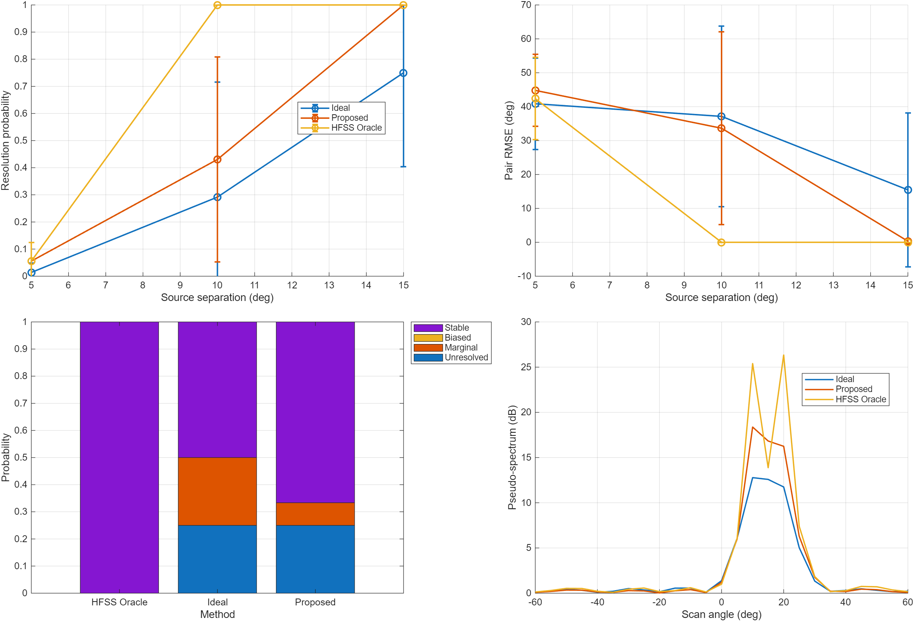

# 研究变更记录

这份文档用于长期记录项目里的研究判断、实验变更、代码方向调整和论文表述收束。

更新方式：
- 你把新的原始文字、实验结论、疑问或修改想法发给我。
- 我负责阅读、去重、归类、压缩成可执行的记录。
- 新内容优先整理进“最新整理”，必要时再沉淀到“历史记录”。

建议每次更新都尽量落成下面这几类信息：
- 当前判断
- 已确认事实
- 主要风险或偏离点
- 下一步动作
- 对论文表述的影响

## 最新整理

### 2026-04-17：`case09` 已从“容易分开”改成“近阈值分辨率扫描”

#### 一句话结论

`case09` 已经从少量居中对称、明显容易分开的双源样例，改成覆盖近阈值困难区的 separation sweep，并补入状态分级，使它开始能够支撑“接近分辨率极限时不同流形方法有明显差异”这一论点。

#### 当前判断

- 这次改动方向是正确的，核心不是再多加几个 source pair，而是把 benchmark 的难度区间重新定义到真正有区分度的区域。
- `case09` 现在比之前更接近“分辨率测试”而不是“普通双源定位演示”。
- 目前它已经能区分 `unresolved / marginal / biased / stable` 这几类状态，但由于 HFSS 角度网格仍然是 `5 deg` 步进，状态边界仍然会受 coarse grid 影响。

#### 实验结果图

下面这张图来自缩小版 `case09` smoke run，用于确认重构后的 benchmark 形式已经成立。该图不是最终论文主图，对应的是快速验证配置，而不是完整默认参数。

图中已经可以看到新的 `case09` 结构同时包含：
- 按 separation 聚合的 resolution probability
- 按 separation 聚合的 pair RMSE
- representative hard pair 的状态分解
- representative hard spectrum

#### 已确认事实

- 改动文件已落在：
  - `default_config.m`
  - `run_project.m`
  - `src/benchmark_music.m`
- `case09` 默认配置不再写死为少量宽间隔对称源对，而是改成近阈值 separation sweep：
  - `separationSweepDeg = [5 10 15]`
  - 自动从当前 HFSS 角度网格生成 pair
  - 不再只取居中的对称 pair，会自然包含偏中心、边缘附近和非对称组合
- 双源 benchmark 新增了状态分级输出：
  - `perTargetResolutionRate`
  - `perTargetMarginalRate`
  - `perTargetBiasedRate`
  - `perTargetStableRate`
  - `perTargetUnresolvedRate`
- `case09` 的结果图已经从原来的“三条简单曲线 + 一个写死示例谱图”改成：
  - 按 separation 聚合后的 resolution probability
  - 按 separation 聚合后的 pair RMSE
  - 代表性困难样例的状态分解柱图
  - 自动挑选的 representative hard spectrum
- `benchmark_music` 的双峰挑选逻辑做了修正，不再因为过强的一格间隔限制而压制 close peaks。
- 已做过缩小版 smoke test，只跑 `case09`，链路能正常运行，且在缩小配置下已经出现了 `marginal / biased / stable` 的分层。

#### 这次改动实际解决了什么

1. 解决了旧 `case09` 的 source pair 大多过于轻松、无法打到困难区的问题。
2. 解决了旧 benchmark 只能回答“有没有分开”，不能回答“勉强分开、分开但偏了、稳定分开”这些不同状态的问题。
3. 解决了示例谱图不够代表真实困难样例的问题，示例 pair 现在由 benchmark 结果自动挑选，而不是写死。

#### 仍然存在的风险或边界

- 当前 HFSS 角度仍是 `[-60, 60]` 上 `5 deg` 间隔，严格说这还是 coarse-grid near-threshold benchmark，不是连续角域下的真正分辨率极限。
- `marginal / biased / stable` 的分界目前是工程化判据，不是经典解析分辨率定义；论文里应把它表述为“状态分级统计”而不是理论极限本身。
- 默认 separation sweep 目前是 `[5 10 15]`，已经比原来更难，但是否足够还要看完整 Monte Carlo 结果图；如果大部分 pair 仍然过稳，后续需要继续向 `5 deg` 甚至更细分的困难区压缩。
- 示例样例当前是按“状态更混合、分辨概率不极端”的准则自动选取，能代表困难区，但不保证每次都是最直观的视觉样例。

#### 下一步动作

- 跑一版完整默认参数的 `case09`，确认正式结果图里 separation 维度上的曲线确实落在有区分度的难区，而不是仍然很快饱和。
- 读回 `case09_results.mat`，检查各 separation 下 pair 数量是否平衡，避免某一档只靠极少数边缘 pair 支撑结论。
- 若完整结果里 `marginal` 占比仍然过低，就继续收紧 pair 设计或重新调状态阈值，使“勉强分开”这档更稳定可见。
- 如果后续要把 `case09` 作为论文主图之一，需要在图注和正文里明确说明：
  - true data 仍由 HFSS manifold 生成
  - benchmark 是 near-threshold separation sweep
  - 状态分级是经验判据而非解析 Rayleigh 限

#### 对论文表述的影响

- 现在可以比之前更有把握地说：`case09` 不再只是“两个源也能估到”的演示，而是在接近分辨阈值的困难区比较不同流形质量对 MUSIC 分辨表现的影响。
- 论文里关于“双源分辨率提升”的表述仍应保持克制，建议写成：
  - “在近阈值 separation sweep 下，所提流形能提高 resolved / stable resolved 的比例，并降低 pair RMSE”
  - 不建议直接写成“显著提升阵列理论分辨极限”
- 如果后续完整结果显示 `Proposed` 相比 `Ideal` 明显改善，但与 `HFSS Oracle` 仍有较大差距，这个差距本身也应作为结果的一部分保留，而不是回避。

### 2026-04-17：实验框架方向基本正确，但验证难度偏低

#### 一句话结论

当前代码框架与论文设想大体一致，但若干 DOA benchmark 设得过于容易，导致关键 case 还不能充分证明想证明的结论。

#### 当前判断

- 框架设计基本正确。
- 证据强度目前不足。
- 问题主要出在 benchmark 设置，而不一定是方法本身错误。

#### 已确认与应当保留的部分

- case 结构整体与论文证据链对齐。
- 已经做了校准角与测试角分离。
- 相位主导假设有结果支持。
- 低阶模型方向合理，模型阶数升高到约 3 后趋于饱和。
- 已经纳入 `Ideal`、`Interpolation`、`Proposed`、`HFSS Oracle` 等对比对象。
- 核心方法主线应继续保留：
  - 稀疏校准
  - 相位主导修正
  - 在 `u = sin(theta)` 域做低维拟合
  - 用重构流形恢复 DOA，而不是只做理想流形下的简单 on-grid 实验

#### 当前最主要的问题

1. `case01` 没有真正展示出高 SNR 下的模型失配误差地板。
2. `case04` 的 DOA 指标已经饱和，无法回答“校准角数量何时不足、何时饱和”。
3. `case08` 没有清楚分离“快拍数降低统计误差”和“模型误差不会自行消失”。
4. `case09` 还不是严格意义上的分辨率极限测试。
5. 当前未见角测试仍然过于接近 coarse-grid on-grid 评估。
6. `Proposed` 与 `Interpolation` 的差距还没有被明确拉开。
7. `Amp+Phase` 更像 oracle upper bound，不应和可实现方法放在同一层级叙述。

#### 最怀疑的代码偏离点

- 真值角和扫描角都过于依赖同一套 HFSS 角度网格。
- 双源分辨 case 的源间隔设置还没有打到真正困难区。
- 若干 case 的 SNR、快拍数、角度分布或判定阈值组合得太“友好”。
- baseline 压力不足，掩盖了 proposed 与 interpolation 的真实差异。

#### 下一步代码检查重点

- 检查真值角生成与扫描角网格设置。
- 检查 `case01` 中数据生成端与估计端是否真正分离。
- 检查 `case04`、`case08` 的 SNR、快拍数、角度和容差设置。
- 重写 `case09` 的 source pair 设计，使其覆盖接近阵列分辨极限的区间。
- 统一结果数组类型，避免 RMSE、概率等量落入整数容器。

#### 对论文表述的直接影响

- 目前更准确的说法不是“代码方向错了”，而是“实验壳子搭对了，但验证难度和验证目标还没有完全对齐”。
- 如果后续更困难设置下 `Proposed` 仍与 `Interpolation` 接近，就需要主动收窄论文主张。
- `Amp+Phase` 应写成 oracle 上界，而不是同预算竞争方法。

#### 已落地的项目管理动作

- 已在仓库中建立中文 issue 结构，作为论文实验执行清单。
- 已建立总控 issue：`#10 总控：论文实验对齐与执行路线图`。
- 已拆出以下主线任务：
  - 代码审计
  - benchmark 重构
  - baseline 差异验证
  - 论文证据链收束

## 历史记录

当前暂无更早整理条目。后续每轮更新将按日期追加。
